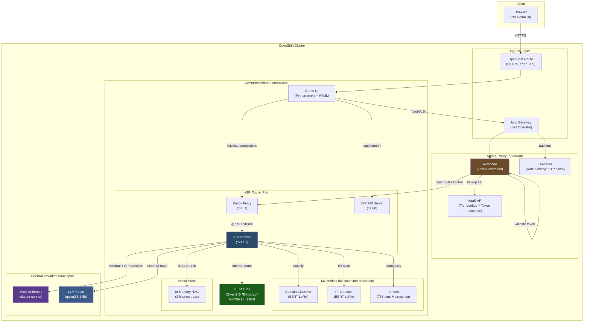
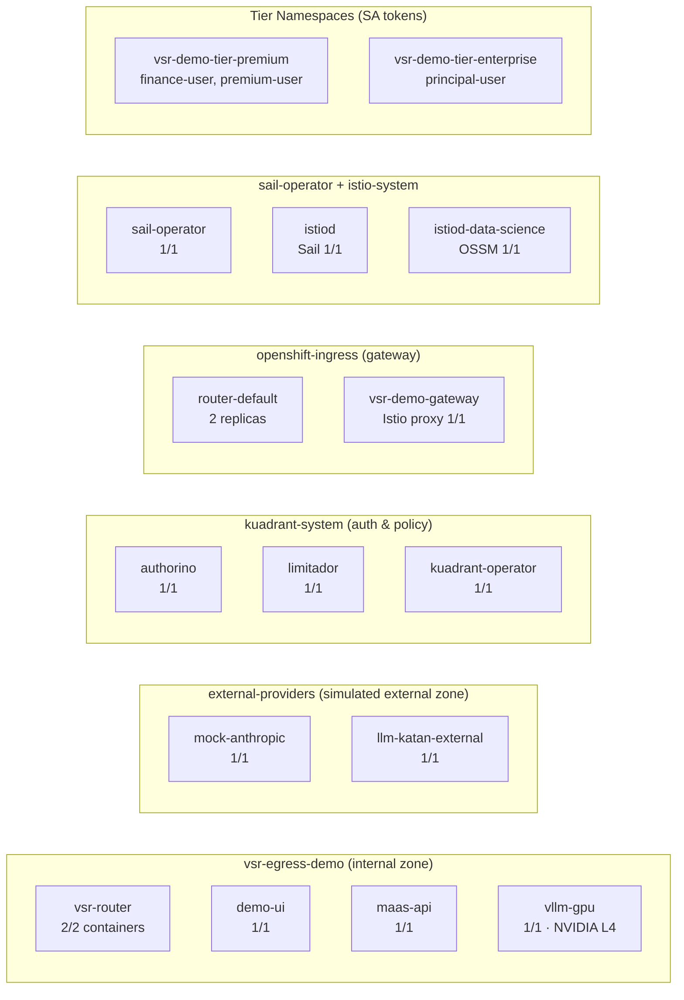

# vSR Egress Routing Demo — Architecture

## Architecture Overview


## Deployment Topology


## Component Diagram (Mermaid)



## Request Flow (Text Description)

### Direct Flow (no auth)
```
Browser → OpenShift Route (HTTPS)
  → Demo UI (demo-server.py, port 8888)
    → Envoy Proxy (port 8801)
      → vSR ExtProc (gRPC, port 50051)
        1. Extract model from request body
        2. If model="auto":
           a. Domain classification (BERT LoRA) → math, CS, business, etc.
           b. Complexity evaluation (mmbert embeddings) → easy, medium, hard
           c. PII detection (BERT LoRA) → PERSON, EMAIL, SSN, etc.
           d. Decision engine evaluates rules by priority:
              - Priority 200: easy → internal (qwen2.5-7b)
              - Priority 100: math/CS domain → external (claude-sonnet)
              - Priority 1: default → internal (qwen2.5-7b)
           e. PII policy check (per-destination):
              - Internal: allow name/SSN/phone, block email
              - External: block all personal PII
        3. Tier policy check (X-MaaS-Tier header)
        4. API translation if Anthropic format
        5. Route to selected backend
      → Backend responds
        → vSR translates response if needed
          → Envoy returns to client
```

### Authenticated Flow (via Kuadrant Gateway)
```
Browser → OpenShift Route (HTTPS)
  → Demo UI (demo-server.py)
    → Istio Gateway (Sail Operator, port 80)
      → Kuadrant Wasm Shim
        → Limitador: rate limit check (10 req/min global)
        → Authorino: validate K8s SA token (audience: vsr-demo-gateway-sa)
          → MaaS API: POST /v1/tiers/lookup → resolve tier (free/premium/enterprise)
          → Inject headers: X-MaaS-Username, X-MaaS-Tier, X-MaaS-Group
      → Envoy Proxy → vSR ExtProc (same as direct flow above)
```

### Token Issuance Flow
```
Browser selects department
  → Demo UI: POST /api/admin/token
    1. K8s TokenRequest API → bootstrap token (10 min TTL, audience: vsr-demo-gateway-sa)
    2. POST /v1/tokens via Istio Gateway → MaaS API issues long-lived token (4h)
    3. Return bootstrap token to browser for auth gateway requests
```

### RAG Flow (Finance department)
```
User sends query
  → Demo UI searches vector store: POST /api/admin/rag-search
    → vSR API: POST /v1/vector_stores/{id}/search
      → mmbert 768-dim embedding similarity
      → Return top-K chunks above threshold 0.55
  → Demo UI constructs messages:
    - system: "--- CONTEXT ---\n[RAG chunks]\n--- END CONTEXT ---"
    - user: original query (clean, for classification)
  → Send to auth gateway (vSR classifies user message, model sees both)
```

## Components Summary

| Component | Image | Port | Purpose |
|-----------|-------|------|---------|
| Demo UI | demo-ui (built on cluster) | 8888 | Web UI + API proxy |
| vSR ExtProc | quay.io/jabadia/vsr-extproc | 50051, 8080 | Classification, routing, API translation |
| Envoy | envoyproxy/envoy:v1.33.2 | 8801 | L7 proxy with ExtProc filter |
| vLLM GPU | vllm/vllm-openai | 8000 | Qwen2.5-7B-Instruct on NVIDIA L4 |
| Mock Anthropic | mock-anthropic (built on cluster) | 8003 | Claude-sonnet mock |
| LLM Katan | llm-katan | 8000 | OpenAI external mock |
| MaaS API | maas-api | 8080 | Tier lookup + token issuance |
| Istio Gateway | istio-proxy (Sail) | 80 | Gateway API ingress |
| Authorino | authorino | - | Token validation + header injection |
| Limitador | limitador | - | Rate limiting |

## Decision Rules (Priority Order)

| Priority | Decision | Conditions | Model | PII Policy |
|----------|----------|------------|-------|------------|
| 200 | easy_internal | complexity=easy | qwen2.5-7b | Allow name/SSN/phone, block email |
| 100 | math_external | domain=math | claude-sonnet | Block all personal PII |
| 100 | cs_external | domain=CS | claude-sonnet | Block all personal PII |
| 1 | default_internal | any complexity | qwen2.5-7b | Allow name/SSN/phone, block email |

## Tier Access Policy

| Tier | Models | Rate Limit |
|------|--------|------------|
| Free (Intern) | qwen2.5-7b only | 10 req/min |
| Premium (Finance) | qwen2.5-7b, qwen2.5:1.5b, claude-sonnet | 10 req/min |
| Enterprise (Principal) | * (all) | 10 req/min |

## OpenShift Deployment Topology

### Namespace Layout



### Namespace Security Boundaries

| Namespace | Purpose | Network Access | Service Accounts |
|-----------|---------|---------------|-----------------|
| `vsr-egress-demo` | Internal zone — vSR, demo UI, GPU model, MaaS API | Can reach external-providers | demo-ui (cluster admin for SA mgmt), maas-api (cluster reader), free-user, intern-user |
| `external-providers` | Simulated external zone — mock Anthropic + OpenAI | Isolated, only accessed by vSR | default only |
| `vsr-demo-tier-premium` | Premium tier SA namespace | No pods, SA tokens only | finance-user, premium-user |
| `vsr-demo-tier-enterprise` | Enterprise tier SA namespace | No pods, SA tokens only | principal-user |
| `kuadrant-system` | Auth infrastructure — Authorino, Limitador, operator | Cluster-scoped policies | operator SAs |
| `openshift-ingress` | Gateway layer — OpenShift router + Istio gateway | External LB (AWS ELB) | istio-injection=enabled |
| `sail-operator` | Istio control plane operator | Manages istio-system | operator SA |
| `istio-system` | Istio data plane — istiod (Sail + OSSM) | NetworkPolicy: allow-sail-gateway | istiod SAs |
| `istio-cni` | Istio CNI plugin (per-node DaemonSet) | All nodes | istio-cni SA |

### Pod Details

#### vsr-egress-demo namespace

| Pod | Containers | Image | Ports | Resources | Node Affinity |
|-----|-----------|-------|-------|-----------|---------------|
| vsr-router | semantic-router, envoy-proxy | quay.io/jabadia/vsr-extproc + envoyproxy/envoy:v1.33.2 | 50051 (gRPC), 8801 (HTTP), 8080 (API) | 2Gi/4Gi mem, 1/2 CPU | Any worker |
| demo-ui | demo-ui | Built on cluster (Python 3.11) | 8888 (HTTP) | 128Mi/1Gi mem | Any worker |
| maas-api | maas-api | Built on cluster (Go) | 8080 (HTTP) | — | Any worker |
| vllm-gpu | vllm | vllm/vllm-openai:latest | 8000 (HTTP) | 8Gi/16Gi mem, nvidia.com/gpu: 1 | nvidia.com/gpu.present=true |

#### vsr-router pod (2 containers)

```
┌─────────────────────────────────────────────────┐
│ vsr-router pod                                   │
│                                                  │
│  ┌──────────────────┐  ┌──────────────────────┐ │
│  │ envoy-proxy      │  │ semantic-router      │ │
│  │ :8801 (HTTP in)  │──│ :50051 (gRPC ExtProc)│ │
│  │                  │  │ :8080 (API server)   │ │
│  │ Routes requests  │  │ Classification       │ │
│  │ to backends via  │  │ Complexity (mmbert)  │ │
│  │ ExtProc filter   │  │ PII detection        │ │
│  └──────────────────┘  │ Decision engine      │ │
│                        │ API translation      │ │
│  Volumes:              │ Vector store (RAG)   │ │
│  - config (ConfigMap)  └──────────────────────┘ │
│  - models (emptyDir)                            │
│  - rag-docs (ConfigMap)                         │
│                                                  │
│  Init container: download-models                 │
│  - Downloads from HuggingFace:                   │
│    mom-domain-classifier, mom-pii-classifier,   │
│    mom-embedding-light, mom-embedding-ultra      │
│                                                  │
│  postStart hook: auto-index RAG docs            │
│  - Creates vector store from /app/rag-docs/     │
└─────────────────────────────────────────────────┘
```

### Network Flow (with security boundaries)

```
Internet
  │
  ▼
┌─────────────────────────────────────────────────────────┐
│ AWS ELB (2 load balancers)                              │
│  - router-default: *.apps.cluster-xxx (OpenShift routes)│
│  - vsr-demo-gateway: Istio Gateway (auth path)          │
└────────────────┬───────────────────┬────────────────────┘
                 │                   │
    ┌────────────▼──────┐  ┌────────▼─────────────────┐
    │ openshift-ingress  │  │ openshift-ingress         │
    │ router-default     │  │ vsr-demo-gateway (Istio)  │
    │ (HTTPS → HTTP)     │  │ (HTTP + auth enforcement) │
    └────────┬───────────┘  └────────┬────────────────┘
             │                       │
             │              ┌────────▼────────────────┐
             │              │ kuadrant-system           │
             │              │ Limitador → rate check    │
             │              │ Authorino → token validate│
             │              │   → MaaS API tier lookup  │
             │              │   → inject X-MaaS-* hdrs  │
             │              └────────┬────────────────┘
             │                       │
    ┌────────▼───────────────────────▼────────────────┐
    │ vsr-egress-demo                                  │
    │                                                  │
    │  demo-ui ←──→ vsr-router ←──→ vllm-gpu          │
    │               (Envoy+vSR)     (NVIDIA L4)        │
    │                    │                             │
    └────────────────────┼─────────────────────────────┘
                         │ (cross-namespace)
    ┌────────────────────▼─────────────────────────────┐
    │ external-providers                                │
    │  mock-anthropic (claude-sonnet)                   │
    │  llm-katan-external (qwen2.5:1.5b)              │
    └──────────────────────────────────────────────────┘
```

### RBAC

| ClusterRoleBinding | Role | ServiceAccount | Purpose |
|-------------------|------|----------------|---------|
| demo-ui-admin | demo-ui-admin (ClusterRole) | vsr-egress-demo/demo-ui | Create/delete ServiceAccounts, create tokens, read ConfigMaps |
| maas-api-vsr-demo | maas-api-vsr-demo (ClusterRole) | vsr-egress-demo/maas-api | Read ServiceAccounts for tier resolution |

### ConfigMaps

| Name | Namespace | Contents |
|------|-----------|----------|
| vsr-egress-config | vsr-egress-demo | vSR routing config (decisions, complexity rules, PII policy) |
| envoy-egress-config | vsr-egress-demo | Envoy proxy config (ExtProc filter, clusters) |
| rag-docs | vsr-egress-demo | Finance documents (3 .md files for RAG) |
| demo-config | vsr-egress-demo | Auth gateway hostname for demo-server.py |

### Secrets

| Name | Namespace | Contents |
|------|-----------|----------|
| demo-tokens | vsr-egress-demo | Pre-generated free/premium tokens (48h TTL) |

### Infrastructure Dependencies

| Component | Operator | Version | Purpose |
|-----------|----------|---------|---------|
| Sail Operator | community-operators | v1.28.3 | Istio for Gateway API (required by Kuadrant) |
| Kuadrant Operator | kuadrant-operator-catalog | v1.3.1 | AuthPolicy + RateLimitPolicy |
| NVIDIA GPU Operator | certified-operators | — | GPU device plugin + drivers |
| NFD | openshift-nfd | — | Node feature discovery (GPU labels) |

### Cluster Nodes

| Role | Instance Type | Count | GPU |
|------|--------------|-------|-----|
| Control plane (master) | — | 3 | — |
| Worker (CPU) | — | 2 | — |
| Worker (GPU) | g5.xlarge | 1 | NVIDIA A10G 24GB (or L4 23GB on RHOAI) |
