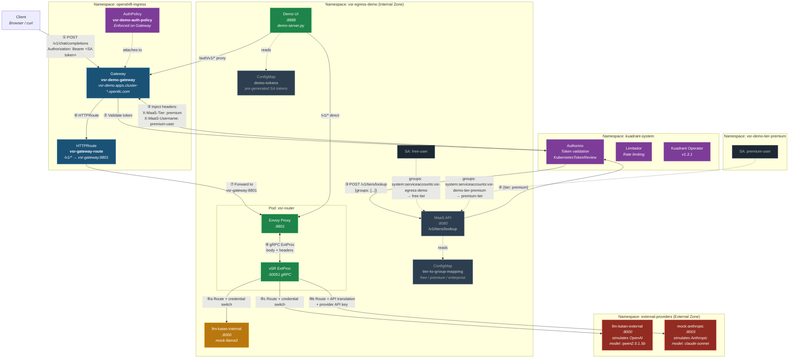

# Phase C Deployment Architecture

## OpenShift Deployment Diagram

## Component Summary

| Component | Namespace | Purpose |
|-----------|-----------|---------|
| **Gateway** | openshift-ingress | Entry point, hostname-based routing |
| **AuthPolicy** | openshift-ingress | Token validation + tier header injection |
| **Authorino** | kuadrant-system | KubernetesTokenReview + HTTP callbacks |
| **Limitador** | kuadrant-system | Rate limiting engine |
| **MaaS API** | vsr-egress-demo | Tier lookup from SA group membership |
| **Envoy + vSR ExtProc** | vsr-egress-demo | Intelligent routing, API translation, tier enforcement |
| **Demo UI** | vsr-egress-demo | Interactive web demo + proxy |
| **llm-katan-internal** | vsr-egress-demo | Internal model (mock-llama3) |
| **llm-katan-external** | external-providers | Simulates external OpenAI-compatible API |
| **mock-anthropic** | external-providers | Simulates external Anthropic API |
| **free-user SA** | vsr-egress-demo | Free tier demo identity |
| **premium-user SA** | vsr-demo-tier-premium | Premium tier demo identity |

## Auth Flow (numbered steps from diagram)

1. Client sends request with SA token
2. Gateway delegates to Authorino for token validation
3. Authorino calls MaaS API with user's Kubernetes groups
4. MaaS API returns tier (free/premium/enterprise)
5. Authorino injects `X-MaaS-Tier` and `X-MaaS-Username` headers
6. Gateway matches HTTPRoute
7. Request forwarded to Envoy (vsr-gateway service)
8. Envoy invokes vSR ExtProc via gRPC (reads headers + body)
9. vSR checks tier policy, routes to correct backend:
   - **9a**: Internal model — direct, no translation
   - **9b**: Anthropic — credential switch + OpenAI→Anthropic translation
   - **9c**: OpenAI-compatible — credential switch, no translation
