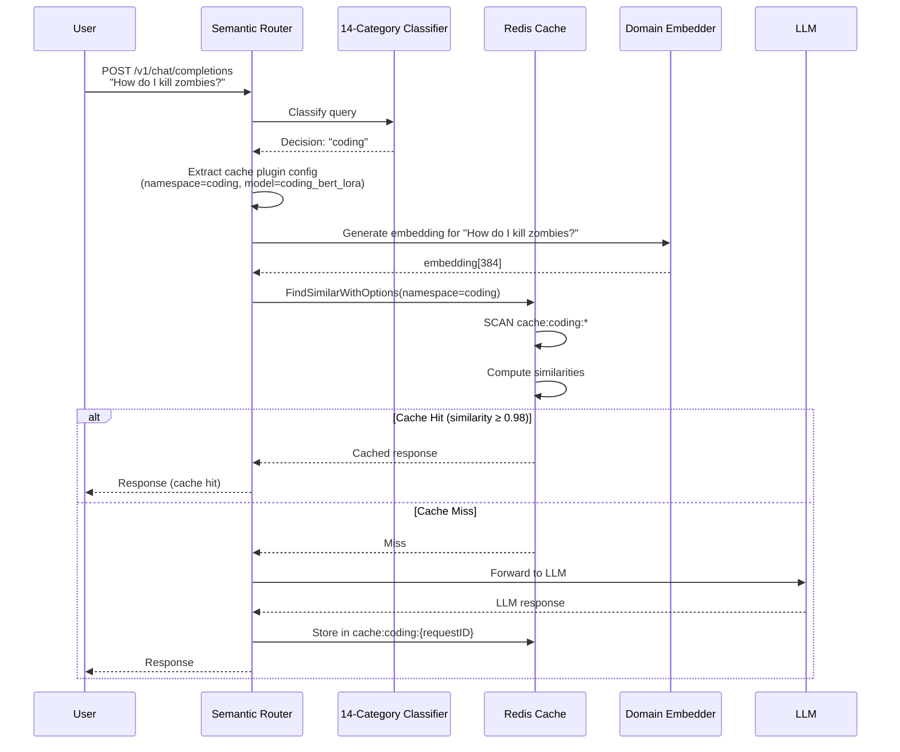

# Domain-Specific Semantic Caching - Implementation Design

**Status**: Proof-of-Concept (POC)
**Branch**: `feat/domain-specific-cache-poc`
**Paper Reference**: arXiv:2504.02268 - "Domain-Specific Semantic Caching"
**Date**: 2025-12-11

---

## Table of Contents
1. [Executive Summary](#executive-summary)
2. [Problem Statement](#problem-statement)
3. [Architecture Overview](#architecture-overview)
4. [Implementation Plan](#implementation-plan)
5. [Training Pipeline](#training-pipeline)
6. [Configuration Specification](#configuration-specification)
7. [Testing Strategy](#testing-strategy)
8. [Success Metrics](#success-metrics)

---

## Executive Summary

This document outlines the implementation of **hierarchical, mixture-of-experts (MoE) semantic caching** for semantic-router based on the research paper arXiv:2504.02268. The core innovation is using **domain-specific embedding models** with **namespace-isolated cache storage** to eliminate semantic drift and improve cache hit rates.

### Key Design Decisions

| Decision | Choice | Rationale |
|----------|--------|-----------|
| Namespace Isolation | **Hard Isolation** (separate Redis namespaces) | Prevents cross-domain contamination |
| Embedding Strategy | **Single domain-specific model per namespace** | One trained cache model per category (e.g., medical, coding) |
| Routing Approach | **Decision-driven caching** | Reuse existing 14-category classifier for domain determination |
| Threshold Configuration | **Per-namespace, configurable** | Allow domain-specific tuning (medical: 0.98, coding: 0.90) |
| Namespace Lifecycle | **TTL-based auto-cleanup** | Remove unused namespaces after inactivity period |
| Model Loading | **Hybrid: Lazy (testing) / Pre-load (production)** | Configurable via environment variable |
| Backward Compatibility | **Hybrid mode** | Support global cache + namespaced cache simultaneously |
| Cache Backend | **Redis with key prefixes** | Pattern: `cache:{namespace}:{requestID}` |

### POC Scope
- **Single domain**: Coding (computer science category from 14-category MMLU classifier)
- **Training objective**: Contrastive learning on coding query pairs
- **Expected improvement**: +15-30% cache hit rate for coding queries
- **Success criteria**: Trained model converges, namespace isolation works, measurable hit rate improvement
- **Key test case**: "How do I kill zombies?" should match "How to terminate zombie processes?" (NOT zombie movies/survival)

---

## Problem Statement

### Current State (Monolithic Caching)
```
User Query → Generic BERT (384-dim) → Single Vector Space → Cache Hit/Miss
```

**Problems**:
1. **Semantic Drift**: Generic embeddings fail on domain-specific jargon
   - Example: "zombie process" vs "defunct process" (identical in coding context)
   - Example: "statute" vs "law" (subtle legal distinctions)
2. **One-size-fits-all threshold**: Coding queries need stricter matching (0.98) than coding (0.90)
3. **No domain isolation**: Medical cache pollution from coding queries

### Proposed State (Domain-Specific Caching)
```
User Query
  ↓
Classification (14-category MMLU) → Decision = "coding"
  ↓
Domain-Specific Cache
  ├─ Specialized Embedder: Coding-BERT-LoRA (384-dim, trained on coding query pairs)
  ├─ Namespace: cache:coding:*
  ├─ Threshold: 0.98 (stricter)
  └─ Cache Hit/Miss
```

**Benefits**:
1. **Specialized embeddings** capture domain semantics (e.g., "zombie" = defunct process, NOT undead)
2. **Namespace isolation** prevents cross-domain pollution
3. **Domain-specific thresholds** optimize precision/recall tradeoffs per use case
4. **Better hit rates**: Paper reports +15-30% improvement

---

## Architecture Overview

### System Components

```
┌─────────────────────────────────────────────────────────────┐
│                    Request Processing                       │
├─────────────────────────────────────────────────────────────┤
│  1. Extract query from OpenAI request                       │
│  2. Classify using 14-category MMLU classifier              │
│     ↓ Matched Decision: "coding"                           │
│  3. Extract semantic-cache plugin config from decision      │
│     - embedding_model_path: "models/coding_cache_bert_lora"│
│     - cache_namespace: "coding"                            │
│     - similarity_threshold: 0.98                            │
│  4. Perform namespace-aware cache lookup                    │
└─────────────────────────────────────────────────────────────┘
                              ↓
┌─────────────────────────────────────────────────────────────┐
│              Cache Backend (Redis)                          │
├─────────────────────────────────────────────────────────────┤
│  Namespace: coding                                         │
│  ├─ Embedder: Coding-BERT-LoRA                            │
│  │   └─ Model Path: models/coding_cache_bert_lora        │
│  ├─ Threshold: 0.98                                        │
│  └─ Redis Keys: cache:coding:{requestID}                 │
│                                                             │
│  Namespace: global (fallback)                              │
│  ├─ Embedder: Generic BERT                                │
│  ├─ Threshold: 0.95                                        │
│  └─ Redis Keys: cache:global:{requestID}                  │
└─────────────────────────────────────────────────────────────┘
```

### Data Flow



---

## Implementation Plan

### Phase 1: Configuration & Infrastructure

#### 1.1 Extend `DecisionPlugin` Configuration
**File**: `pkg/config/config.go`

```go
// SemanticCachePluginConfig represents configuration for semantic-cache plugin
type SemanticCachePluginConfig struct {
    Enabled             bool     `json:"enabled" yaml:"enabled"`
    SimilarityThreshold *float32 `json:"similarity_threshold,omitempty" yaml:"similarity_threshold,omitempty"`

    // NEW: Domain-specific embedding model
    // Path to domain-specific embedding model (e.g., "models/coding_cache_bert_lora")
    // If not specified, uses global semantic_cache.embedding_model
    EmbeddingModelPath  *string  `json:"embedding_model_path,omitempty" yaml:"embedding_model_path,omitempty"`

    // NEW: Cache namespace for isolation
    // Format: "coding", "coding", etc. (becomes Redis key prefix: "cache:coding:")
    // If not specified, uses decision name as namespace
    CacheNamespace      *string  `json:"cache_namespace,omitempty" yaml:"cache_namespace,omitempty"`
}
```

**Example YAML** (POC - Medical Domain):
```yaml
decisions:
  - name: medical
    description: "Coding and computer science queries"
    rules:
      operator: OR
      conditions:
        - type: domain
          name: computer science  # Maps to 14-category MMLU classifier
    modelRefs:
      - model: medical-llm-7b
    plugins:
      - type: semantic-cache
        configuration:
          enabled: true
          similarity_threshold: 0.98  # Stricter for medical
          embedding_model_path: "models/coding_cache_bert_lora"
          cache_namespace: "coding"
```

#### 1.2 Update Cache Interface
**File**: `pkg/cache/cache_interface.go`

```go
// CacheLookupOptions provides namespace-aware cache lookup configuration
type CacheLookupOptions struct {
    Threshold          float32  // Similarity threshold (0.0-1.0)
    EmbeddingModelPath string   // Path to domain-specific embedding model
    Namespace          string   // Cache namespace (e.g., "coding", "coding")
}

type CacheBackend interface {
    // Existing methods (unchanged)
    IsEnabled() bool
    CheckConnection() error
    FindSimilar(model string, query string) ([]byte, bool, error)
    FindSimilarWithThreshold(model string, query string, threshold float32) ([]byte, bool, error)
    AddPendingRequest(requestID, model, query string, body []byte) error
    UpdateWithResponse(requestID string, responseBody []byte) error
    AddEntry(requestID, model, query string, reqBody, respBody []byte) error
    Close() error
    GetStats() CacheStats

    // NEW: Namespace-aware methods
    FindSimilarWithOptions(model string, query string, options CacheLookupOptions) ([]byte, bool, error)
    AddPendingRequestWithNamespace(requestID, model, query string, body []byte, namespace string) error
    UpdateWithResponseInNamespace(requestID string, responseBody []byte, namespace string) error
    AddEntryWithNamespace(requestID, model, query string, reqBody, respBody []byte, namespace string) error

    // Namespace management
    ListNamespaces() ([]string, error)
    ClearNamespace(namespace string) error
    GetNamespaceStats(namespace string) CacheStats
}
```

---

### Phase 2: Redis Namespace Implementation

#### 2.1 Namespace Data Structures
**File**: `pkg/cache/redis_cache.go`

```go
type RedisCache struct {
    // ... existing fields ...

    // NEW: Namespace management
    namespaces          map[string]*NamespaceEmbedder  // namespace → embedding model
    namespacesMu        sync.RWMutex
    enabledNamespaces   map[string]bool                 // Track active namespaces
    lazyLoadModels      bool                            // Lazy vs pre-load (env: LAZY_LOAD_CACHE_MODELS)
}

// NamespaceEmbedder wraps a domain-specific embedding model
type NamespaceEmbedder struct {
    modelPath       string
    embeddingFunc   func(string) ([]float32, error)  // Lazily loaded
    lastUsed        time.Time
    initialized     bool
    mu              sync.RWMutex
}
```

#### 2.2 Redis Key Prefix Pattern

**Current**: `semantic_cache:{requestID}`

**New Pattern**:
```
cache:global:{requestID}     # Default/fallback namespace
cache:coding:{requestID}    # Coding domain queries
cache:coding:{requestID}     # Coding domain queries
cache:finance:{requestID}    # Finance domain queries
```

**Key Builder**:
```go
func (c *RedisCache) buildRedisKey(requestID, namespace string) string {
    if namespace == "" {
        namespace = "global"
    }
    return fmt.Sprintf("cache:%s:%s", namespace, requestID)
}
```

#### 2.3 Namespace Embedder Implementation

```go
// getOrCreateNamespaceEmbedder lazy-loads domain-specific embedding model
func (c *RedisCache) getOrCreateNamespaceEmbedder(namespace, modelPath string) (*NamespaceEmbedder, error) {
    c.namespacesMu.Lock()
    defer c.namespacesMu.Unlock()

    if embedder, exists := c.namespaces[namespace]; exists {
        embedder.lastUsed = time.Now()
        return embedder, nil
    }

    // Create new namespace embedder
    embedder := &NamespaceEmbedder{
        modelPath: modelPath,
        lastUsed:  time.Now(),
    }

    // Load embedding model (lazy or immediate based on config)
    if !c.lazyLoadModels {
        if err := embedder.initialize(); err != nil {
            return nil, fmt.Errorf("failed to pre-load embedding model for namespace '%s': %w", namespace, err)
        }
    }

    c.namespaces[namespace] = embedder
    c.enabledNamespaces[namespace] = true

    logging.Infof("Created namespace '%s' with embedding model: %s (lazy_load=%v)",
        namespace, modelPath, c.lazyLoadModels)

    return embedder, nil
}

// initialize loads the domain-specific embedding model
func (n *NamespaceEmbedder) initialize() error {
    n.mu.Lock()
    defer n.mu.Unlock()

    if n.initialized {
        return nil
    }

    logging.Infof("Loading domain-specific embedding model from: %s", n.modelPath)

    // Load LoRA fine-tuned BERT model for domain-specific embeddings
    // This will be implemented in candle-binding after training pipeline is ready
    err := candle_binding.InitDomainEmbeddingModel(n.modelPath, false) // useCPU=false
    if err != nil {
        return fmt.Errorf("failed to load embedding model: %w", err)
    }

    n.embeddingFunc = func(text string) ([]float32, error) {
        return candle_binding.GetDomainEmbedding(n.modelPath, text, 0)
    }

    n.initialized = true
    logging.Infof("Successfully loaded embedding model: %s", n.modelPath)
    return nil
}

// generateEmbedding generates embedding using namespace-specific model
func (n *NamespaceEmbedder) generateEmbedding(text string) ([]float32, error) {
    // Ensure model is loaded (lazy loading)
    if !n.initialized {
        if err := n.initialize(); err != nil {
            return nil, err
        }
    }

    return n.embeddingFunc(text)
}
```

#### 2.4 FindSimilarWithOptions Implementation

```go
func (c *RedisCache) FindSimilarWithOptions(model string, query string, options CacheLookupOptions) ([]byte, bool, error) {
    start := time.Now()

    if !c.enabled {
        return nil, false, nil
    }

    // 1. Get or create namespace embedder
    embedder, err := c.getOrCreateNamespaceEmbedder(options.Namespace, options.EmbeddingModelPath)
    if err != nil {
        metrics.RecordCacheOperation("redis", "find_similar_ns", "error", time.Since(start).Seconds())
        return nil, false, fmt.Errorf("failed to get namespace embedder: %w", err)
    }

    // 2. Generate embedding using domain-specific model
    queryEmbedding, err := embedder.generateEmbedding(query)
    if err != nil {
        metrics.RecordCacheOperation("redis", "find_similar_ns", "error", time.Since(start).Seconds())
        return nil, false, fmt.Errorf("failed to generate domain embedding: %w", err)
    }

    // 3. Search only within namespace (Redis SCAN with pattern: cache:{namespace}:*)
    pattern := fmt.Sprintf("cache:%s:*", options.Namespace)
    entries, err := c.scanNamespace(pattern, model)
    if err != nil {
        return nil, false, err
    }

    // 4. Find best match using domain-specific embedding
    bestSimilarity := float32(-1.0)
    var bestEntry []byte

    for _, entry := range entries {
        // Compute cosine similarity (dot product for normalized embeddings)
        similarity := computeSimilarity(queryEmbedding, entry.Embedding)

        if similarity > bestSimilarity && similarity >= options.Threshold {
            bestSimilarity = similarity
            bestEntry = entry.ResponseBody
        }
    }

    if bestEntry != nil {
        atomic.AddInt64(&c.hitCount, 1)
        logging.Infof("CACHE HIT (namespace=%s): similarity=%.4f >= threshold=%.4f",
            options.Namespace, bestSimilarity, options.Threshold)
        metrics.RecordCacheOperation("redis", "find_similar_ns", "hit", time.Since(start).Seconds())
        metrics.RecordCacheHit()
        return bestEntry, true, nil
    }

    atomic.AddInt64(&c.missCount, 1)
    logging.Debugf("CACHE MISS (namespace=%s): best_similarity=%.4f < threshold=%.4f",
        options.Namespace, bestSimilarity, options.Threshold)
    metrics.RecordCacheOperation("redis", "find_similar_ns", "miss", time.Since(start).Seconds())
    metrics.RecordCacheMiss()
    return nil, false, nil
}
```

#### 2.5 Namespace Scanning

```go
// scanNamespace scans Redis for entries matching namespace pattern
func (c *RedisCache) scanNamespace(pattern string, model string) ([]CacheEntryWithEmbedding, error) {
    ctx := context.Background()
    var entries []CacheEntryWithEmbedding

    // Use SCAN to iterate through keys matching pattern
    iter := c.client.Scan(ctx, 0, pattern, 0).Iterator()
    for iter.Next(ctx) {
        key := iter.Val()

        // Get entry data
        data, err := c.client.HGetAll(ctx, key).Result()
        if err != nil {
            logging.Warnf("Failed to get cache entry %s: %v", key, err)
            continue
        }

        // Filter by model
        if data["model"] != model {
            continue
        }

        // Parse embedding (stored as base64-encoded float32 array)
        embedding, err := parseEmbedding(data["embedding"])
        if err != nil {
            logging.Warnf("Failed to parse embedding for %s: %v", key, err)
            continue
        }

        // Parse response
        responseBody, err := base64.StdEncoding.DecodeString(data["response"])
        if err != nil {
            logging.Warnf("Failed to decode response for %s: %v", key, err)
            continue
        }

        entries = append(entries, CacheEntryWithEmbedding{
            ResponseBody: responseBody,
            Embedding:    embedding,
        })
    }

    return entries, iter.Err()
}

// CacheEntryWithEmbedding holds a cache entry with its embedding
type CacheEntryWithEmbedding struct {
    ResponseBody []byte
    Embedding    []float32
}
```

---

### Phase 3: Request Processing Integration

#### 3.1 Two-Stage Caching Flow
**File**: `pkg/extproc/req_filter_cache.go`

**Current Flow**:
```go
Query → Global Cache Lookup → Hit/Miss
```

**New Flow (Decision-Driven)**:
```go
Query → Classify (14-category) → Get Decision Config → Namespace Cache Lookup → Hit/Miss
```

**Implementation**:

```go
// handleCaching performs cache lookup with decision-aware namespace routing
func (r *OpenAIRouter) handleCaching(ctx *RequestContext, categoryName string) (*ext_proc.ProcessingResponse, bool) {
    // Extract query
    requestModel, requestQuery, err := cache.ExtractQueryFromOpenAIRequest(ctx.OriginalRequestBody)
    if err != nil {
        logging.Errorf("Error extracting query from request: %v", err)
        return nil, false
    }

    ctx.RequestModel = requestModel
    ctx.RequestQuery = requestQuery

    // Check if caching is enabled for this decision
    cacheEnabled := r.Config.SemanticCache.Enabled
    if categoryName != "" {
        cacheEnabled = r.Config.IsCacheEnabledForDecision(categoryName)
    }

    if requestQuery == "" || !r.Cache.IsEnabled() || !cacheEnabled {
        return nil, false
    }

    // NEW: Get decision-specific cache configuration
    decision := r.Classifier.GetDecisionByName(categoryName)
    if decision == nil {
        // Fallback to global cache
        return r.handleGlobalCaching(ctx, requestModel, requestQuery)
    }

    // Extract semantic-cache plugin configuration
    cachePlugin := extractSemanticCachePlugin(decision.Plugins)
    if cachePlugin == nil || !cachePlugin.Enabled {
        // Decision doesn't override caching, use global
        return r.handleGlobalCaching(ctx, requestModel, requestQuery)
    }

    // Build namespace-aware cache lookup options
    options := cache.CacheLookupOptions{
        Threshold:          r.Config.GetCacheSimilarityThresholdForDecision(categoryName),
        EmbeddingModelPath: r.Config.SemanticCache.EmbeddingModel, // Default
        Namespace:          categoryName, // Use decision name as namespace
    }

    // Override with plugin-specific settings
    if cachePlugin.SimilarityThreshold != nil {
        options.Threshold = *cachePlugin.SimilarityThreshold
    }
    if cachePlugin.EmbeddingModelPath != nil {
        options.EmbeddingModelPath = *cachePlugin.EmbeddingModelPath
    }
    if cachePlugin.CacheNamespace != nil {
        options.Namespace = *cachePlugin.CacheNamespace
    }

    logging.Infof("Domain-specific cache lookup: namespace=%s, model=%s, threshold=%.2f",
        options.Namespace, options.EmbeddingModelPath, options.Threshold)

    // Perform namespace-aware cache lookup
    spanCtx, span := tracing.StartSpan(ctx.TraceContext, tracing.SpanCacheLookup)
    defer span.End()

    startTime := time.Now()
    cachedResponse, found, cacheErr := r.Cache.FindSimilarWithOptions(requestModel, requestQuery, options)
    lookupTime := time.Since(startTime).Milliseconds()

    tracing.SetSpanAttributes(span,
        attribute.String(tracing.AttrCacheKey, requestQuery),
        attribute.Bool(tracing.AttrCacheHit, found),
        attribute.Int64(tracing.AttrCacheLookupTimeMs, lookupTime),
        attribute.String(tracing.AttrCategoryName, categoryName),
        attribute.String("cache.namespace", options.Namespace),
        attribute.String("cache.embedding_model", options.EmbeddingModelPath),
        attribute.Float64("cache.threshold", float64(options.Threshold)))

    if cacheErr != nil {
        logging.Errorf("Error searching namespace cache: %v", cacheErr)
        tracing.RecordError(span, cacheErr)
    } else if found {
        ctx.VSRCacheHit = true
        logging.LogEvent("cache_hit_namespace", map[string]interface{}{
            "request_id": ctx.RequestID,
            "model":      requestModel,
            "query":      requestQuery,
            "category":   categoryName,
            "namespace":  options.Namespace,
            "threshold":  options.Threshold,
        })
        response := http.CreateCacheHitResponse(cachedResponse, ctx.ExpectStreamingResponse)
        ctx.TraceContext = spanCtx
        return response, true
    }
    ctx.TraceContext = spanCtx

    // Cache miss - add to pending requests with namespace
    err = r.Cache.AddPendingRequestWithNamespace(ctx.RequestID, requestModel, requestQuery,
        ctx.OriginalRequestBody, options.Namespace)
    if err != nil {
        logging.Errorf("Error adding pending request to namespace cache: %v", err)
    }

    return nil, false
}

// extractSemanticCachePlugin finds the semantic-cache plugin in decision plugins
func extractSemanticCachePlugin(plugins []config.DecisionPlugin) *config.SemanticCachePluginConfig {
    for _, plugin := range plugins {
        if plugin.Type == "semantic-cache" {
            // Parse configuration (handle both map[string]interface{} from YAML and []byte from CRD)
            var cacheConfig config.SemanticCachePluginConfig

            switch cfg := plugin.Configuration.(type) {
            case map[string]interface{}:
                if err := mapstructure.Decode(cfg, &cacheConfig); err != nil {
                    logging.Errorf("Failed to parse semantic-cache plugin config: %v", err)
                    return nil
                }
            case []byte:
                if err := json.Unmarshal(cfg, &cacheConfig); err != nil {
                    logging.Errorf("Failed to unmarshal semantic-cache plugin config: %v", err)
                    return nil
                }
            default:
                logging.Errorf("Unsupported configuration type for semantic-cache plugin: %T", cfg)
                return nil
            }

            return &cacheConfig
        }
    }
    return nil
}

// handleGlobalCaching is the fallback to global cache (backward compatibility)
func (r *OpenAIRouter) handleGlobalCaching(ctx *RequestContext, requestModel, requestQuery string) (*ext_proc.ProcessingResponse, bool) {
    threshold := r.Config.GetCacheSimilarityThreshold()

    startTime := time.Now()
    cachedResponse, found, cacheErr := r.Cache.FindSimilarWithThreshold(requestModel, requestQuery, threshold)
    lookupTime := time.Since(startTime).Milliseconds()

    if cacheErr != nil {
        logging.Errorf("Error searching global cache: %v", cacheErr)
    } else if found {
        ctx.VSRCacheHit = true
        logging.LogEvent("cache_hit_global", map[string]interface{}{
            "request_id": ctx.RequestID,
            "model":      requestModel,
            "query":      requestQuery,
        })
        return http.CreateCacheHitResponse(cachedResponse, ctx.ExpectStreamingResponse), true
    }

    // Add to pending (global namespace)
    r.Cache.AddPendingRequest(ctx.RequestID, requestModel, requestQuery, ctx.OriginalRequestBody)
    return nil, false
}
```

---

### Phase 4: Namespace Lifecycle Management

#### 4.1 TTL-Based Cleanup
**File**: `pkg/cache/redis_cache.go`

```go
// StartNamespaceCleanup starts a background goroutine to clean up unused namespaces
func (c *RedisCache) StartNamespaceCleanup(interval time.Duration, ttl time.Duration) {
    go func() {
        ticker := time.NewTicker(interval)
        defer ticker.Stop()

        for range ticker.C {
            c.cleanupUnusedNamespaces(ttl)
        }
    }()
}

// cleanupUnusedNamespaces removes namespaces that haven't been accessed within TTL
func (c *RedisCache) cleanupUnusedNamespaces(ttl time.Duration) {
    c.namespacesMu.Lock()
    defer c.namespacesMu.Unlock()

    now := time.Now()
    for namespace, embedder := range c.namespaces {
        if now.Sub(embedder.lastUsed) > ttl {
            logging.Infof("Cleaning up unused namespace '%s' (last used: %v ago)",
                namespace, now.Sub(embedder.lastUsed))

            // Clear Redis keys
            pattern := fmt.Sprintf("cache:%s:*", namespace)
            c.clearNamespaceKeys(pattern)

            // Remove from memory
            delete(c.namespaces, namespace)
            delete(c.enabledNamespaces, namespace)

            logging.LogEvent("namespace_cleanup", map[string]interface{}{
                "namespace": namespace,
                "ttl_hours": ttl.Hours(),
            })
        }
    }
}

// clearNamespaceKeys deletes all Redis keys matching the namespace pattern
func (c *RedisCache) clearNamespaceKeys(pattern string) error {
    ctx := context.Background()
    iter := c.client.Scan(ctx, 0, pattern, 0).Iterator()

    var keys []string
    for iter.Next(ctx) {
        keys = append(keys, iter.Val())
    }

    if len(keys) > 0 {
        return c.client.Del(ctx, keys...).Err()
    }

    return iter.Err()
}
```

#### 4.2 Configuration
**Environment Variable**: `CACHE_NAMESPACE_CLEANUP_INTERVAL` (default: 1h)
**Environment Variable**: `CACHE_NAMESPACE_TTL` (default: 24h)

---

## Training Pipeline

### Overview
Train domain-specific embedding models using **LoRA (Low-Rank Adaptation)** fine-tuning on BERT, matching semantic-router's existing training approach for classification models.

### Training Objective
**Contrastive Learning**: Learn embeddings where semantically similar queries (cache hits) have high cosine similarity.

### Directory Structure
```
src/training/cache_embeddings_lora/
├── coding_cache_training.py       # POC: Coding domain fine-tuning
├── prepare_cache_dataset.py        # Convert cache logs to training pairs
├── evaluate_cache_model.py         # Measure hit rate improvement
├── config_medical.yaml             # Training hyperparameters
├── requirements.txt                # Python dependencies
└── README.md                       # Training documentation
```

### Training Data Format

**Source**: Cache logs from production semantic-router deployment

**Positive Pairs** (label=1): Queries that resulted in cache hits
```json
{
  "query1": "How do I kill zombies?",
  "query2": "How to terminate zombie processes?",
  "label": 1
},
{
  "query1": "What is a zombie process?",
  "query2": "Explain defunct processes",
  "label": 1
}
```

**Negative Pairs** (label=0): Random unrelated queries from same domain
```json
{
  "query1": "How do I kill zombies?",
  "query2": "Zombie survival guide",
  "label": 0
},
{
  "query1": "What is a pointer?",
  "query2": "How do I kill zombies?",
  "label": 0
}
```

### Training Script
**File**: `src/training/cache_embeddings_lora/coding_cache_training.py`

```python
#!/usr/bin/env python3
"""
Fine-tune BERT embeddings for coding domain cache using LoRA
Based on semantic-router's existing LoRA training pipeline
"""

import torch
from transformers import BertModel, BertTokenizer, AutoConfig
from peft import get_peft_model, LoraConfig, TaskType
from torch.utils.data import DataLoader, Dataset
import json

class CachePairDataset(Dataset):
    """Dataset of query pairs for contrastive learning"""
    def __init__(self, pairs_file, tokenizer, max_length=128):
        with open(pairs_file) as f:
            self.pairs = json.load(f)["query_pairs"]
        self.tokenizer = tokenizer
        self.max_length = max_length

    def __len__(self):
        return len(self.pairs)

    def __getitem__(self, idx):
        pair = self.pairs[idx]

        # Tokenize both queries
        q1 = self.tokenizer(pair["query1"], max_length=self.max_length,
                           padding="max_length", truncation=True, return_tensors="pt")
        q2 = self.tokenizer(pair["query2"], max_length=self.max_length,
                           padding="max_length", truncation=True, return_tensors="pt")

        return {
            "query1_input_ids": q1["input_ids"].squeeze(),
            "query1_attention_mask": q1["attention_mask"].squeeze(),
            "query2_input_ids": q2["input_ids"].squeeze(),
            "query2_attention_mask": q2["attention_mask"].squeeze(),
            "label": torch.tensor(pair["label"], dtype=torch.float32)
        }

def train_coding_cache_embeddings(
    base_model="bert-base-uncased",
    train_data="data/coding_cache_pairs_train.json",
    val_data="data/coding_cache_pairs_val.json",
    output_dir="models/coding_cache_bert_lora",
    epochs=3,
    batch_size=32,
    learning_rate=5e-4
):
    """
    Fine-tune BERT for coding cache embeddings using LoRA

    This creates a domain-specific embedding model that better captures
    coding terminology similarities (e.g., "zombie" vs "defunct process",
    "kill" vs "terminate" in process context)

    Key example: Generic BERT sees "How do I kill zombies?" as undead/survival,
    but coding-specific BERT understands it as zombie process cleanup.
    """

    # Load base BERT model
    config = AutoConfig.from_pretrained(base_model)
    model = BertModel.from_pretrained(base_model, config=config)
    tokenizer = BertTokenizer.from_pretrained(base_model)

    # Apply LoRA (same approach as classification models)
    lora_config = LoraConfig(
        task_type=TaskType.FEATURE_EXTRACTION,  # For embeddings, not classification
        r=8,  # LoRA rank
        lora_alpha=16,
        target_modules=["query", "value"],  # Apply to attention layers
        lora_dropout=0.1,
        bias="none"
    )

    model = get_peft_model(model, lora_config)
    model.print_trainable_parameters()

    # Prepare datasets
    train_dataset = CachePairDataset(train_data, tokenizer)
    val_dataset = CachePairDataset(val_data, tokenizer)

    train_loader = DataLoader(train_dataset, batch_size=batch_size, shuffle=True)
    val_loader = DataLoader(val_dataset, batch_size=batch_size)

    # Contrastive loss (similar queries should have high cosine similarity)
    def contrastive_loss(emb1, emb2, label, margin=0.5):
        """
        label=1: emb1 and emb2 should be similar (high dot product)
        label=0: emb1 and emb2 should be dissimilar (low dot product)
        """
        cosine_sim = torch.nn.functional.cosine_similarity(emb1, emb2)

        # Positive pairs: minimize (1 - similarity)
        pos_loss = label * (1 - cosine_sim)

        # Negative pairs: minimize max(0, similarity - margin)
        neg_loss = (1 - label) * torch.clamp(cosine_sim - margin, min=0.0)

        return (pos_loss + neg_loss).mean()

    # Training loop
    optimizer = torch.optim.AdamW(model.parameters(), lr=learning_rate)
    device = "cuda" if torch.cuda.is_available() else "cpu"
    model.to(device)

    print(f"Training on {device}...")
    for epoch in range(epochs):
        model.train()
        total_loss = 0

        for batch in train_loader:
            # Get embeddings for both queries (use [CLS] token)
            q1_outputs = model(
                input_ids=batch["query1_input_ids"].to(device),
                attention_mask=batch["query1_attention_mask"].to(device)
            )
            q1_emb = q1_outputs.last_hidden_state[:, 0, :]  # [CLS] token

            q2_outputs = model(
                input_ids=batch["query2_input_ids"].to(device),
                attention_mask=batch["query2_attention_mask"].to(device)
            )
            q2_emb = q2_outputs.last_hidden_state[:, 0, :]  # [CLS] token

            # Compute contrastive loss
            loss = contrastive_loss(q1_emb, q2_emb, batch["label"].to(device))

            optimizer.zero_grad()
            loss.backward()
            optimizer.step()

            total_loss += loss.item()

        avg_loss = total_loss / len(train_loader)
        print(f"Epoch {epoch+1}/{epochs}: Loss = {avg_loss:.4f}")

        # Validation
        model.eval()
        val_loss = 0
        with torch.no_grad():
            for batch in val_loader:
                q1_outputs = model(
                    input_ids=batch["query1_input_ids"].to(device),
                    attention_mask=batch["query1_attention_mask"].to(device)
                )
                q1_emb = q1_outputs.last_hidden_state[:, 0, :]

                q2_outputs = model(
                    input_ids=batch["query2_input_ids"].to(device),
                    attention_mask=batch["query2_attention_mask"].to(device)
                )
                q2_emb = q2_outputs.last_hidden_state[:, 0, :]

                loss = contrastive_loss(q1_emb, q2_emb, batch["label"].to(device))
                val_loss += loss.item()

        print(f"  Validation Loss = {val_loss / len(val_loader):.4f}")

    # Save LoRA adapter
    model.save_pretrained(output_dir)
    tokenizer.save_pretrained(output_dir)

    print(f"Saved medical cache embedding model to {output_dir}")
    print("To use in semantic-router config:")
    print(f"  embedding_model_path: {output_dir}")

if __name__ == "__main__":
    train_coding_cache_embeddings()
```

### Data Preparation Script
**File**: `src/training/cache_embeddings_lora/prepare_cache_dataset.py`

```python
#!/usr/bin/env python3
"""
Prepare training data for cache embedding models from cache logs
"""

import json
import random
from collections import defaultdict

def prepare_cache_pairs_from_logs(
    cache_log_file="logs/semantic_cache.jsonl",
    output_train="data/coding_cache_pairs_train.json",
    output_val="data/coding_cache_pairs_val.json",
    domain_filter="coding",  # Only use queries classified as medical
    val_split=0.2
):
    """
    Convert cache logs into training pairs for contrastive learning

    Positive pairs: Queries that resulted in cache hits (semantically similar)
    Negative pairs: Random queries from the same domain (not similar)
    """

    # Load cache logs
    queries_by_domain = defaultdict(list)
    cache_hits = []  # (query1, query2) pairs that were cache hits

    with open(cache_log_file) as f:
        for line in f:
            log = json.loads(line)
            if log.get("event") == "cache_hit" and log.get("category") == domain_filter:
                # This query matched a cached query - they're similar!
                cache_hits.append((log["cached_query"], log["current_query"]))
                queries_by_domain[domain_filter].append(log["current_query"])
            elif log.get("category") == domain_filter:
                queries_by_domain[domain_filter].append(log["query"])

    # Generate training pairs
    pairs = []

    # Positive pairs (cache hits)
    for q1, q2 in cache_hits:
        pairs.append({"query1": q1, "query2": q2, "label": 1})

    # Negative pairs (random unrelated queries from same domain)
    domain_queries = queries_by_domain[domain_filter]
    for _ in range(len(cache_hits)):
        q1, q2 = random.sample(domain_queries, 2)
        pairs.append({"query1": q1, "query2": q2, "label": 0})

    # Split train/val
    random.shuffle(pairs)
    split_idx = int(len(pairs) * (1 - val_split))

    train_pairs = pairs[:split_idx]
    val_pairs = pairs[split_idx:]

    # Save
    with open(output_train, "w") as f:
        json.dump({"query_pairs": train_pairs}, f, indent=2)

    with open(output_val, "w") as f:
        json.dump({"query_pairs": val_pairs}, f, indent=2)

    print(f"Created {len(train_pairs)} training pairs, {len(val_pairs)} validation pairs")
    print(f"Saved to {output_train} and {output_val}")

if __name__ == "__main__":
    prepare_cache_pairs_from_logs()
```

### Evaluation Script
**File**: `src/training/cache_embeddings_lora/evaluate_cache_model.py`

```python
#!/usr/bin/env python3
"""
Evaluate cache hit rate improvement with domain-specific embeddings
"""

import torch
from transformers import BertModel, BertTokenizer
from peft import PeftModel
import json

def evaluate_cache_model(
    test_pairs_file="data/coding_cache_pairs_test.json",
    generic_model="bert-base-uncased",
    domain_model="models/coding_cache_bert_lora",
    threshold=0.95
):
    """
    Compare cache hit rates: Generic BERT vs Domain-specific BERT
    """

    # Load models
    generic_tokenizer = BertTokenizer.from_pretrained(generic_model)
    generic_bert = BertModel.from_pretrained(generic_model)

    domain_tokenizer = BertTokenizer.from_pretrained(domain_model)
    domain_bert = BertModel.from_pretrained(generic_model)
    domain_bert = PeftModel.from_pretrained(domain_bert, domain_model)

    device = "cuda" if torch.cuda.is_available() else "cpu"
    generic_bert.to(device).eval()
    domain_bert.to(device).eval()

    # Load test pairs
    with open(test_pairs_file) as f:
        test_pairs = json.load(f)["query_pairs"]

    # Evaluate both models
    def compute_hit_rate(model, tokenizer, pairs, threshold):
        hits = 0
        for pair in pairs:
            if pair["label"] == 0:  # Only evaluate on positive pairs
                continue

            # Get embeddings
            with torch.no_grad():
                q1 = tokenizer(pair["query1"], return_tensors="pt", padding=True, truncation=True)
                q1_emb = model(**{k: v.to(device) for k, v in q1.items()}).last_hidden_state[:, 0, :]

                q2 = tokenizer(pair["query2"], return_tensors="pt", padding=True, truncation=True)
                q2_emb = model(**{k: v.to(device) for k, v in q2.items()}).last_hidden_state[:, 0, :]

                # Compute similarity
                similarity = torch.nn.functional.cosine_similarity(q1_emb, q2_emb).item()

                if similarity >= threshold:
                    hits += 1

        positive_count = sum(1 for p in pairs if p["label"] == 1)
        return hits / positive_count if positive_count > 0 else 0.0

    generic_hit_rate = compute_hit_rate(generic_bert, generic_tokenizer, test_pairs, threshold)
    domain_hit_rate = compute_hit_rate(domain_bert, domain_tokenizer, test_pairs, threshold)

    print(f"Threshold: {threshold}")
    print(f"Generic BERT Hit Rate: {generic_hit_rate*100:.1f}%")
    print(f"Domain BERT Hit Rate: {domain_hit_rate*100:.1f}%")
    print(f"Improvement: +{(domain_hit_rate - generic_hit_rate)*100:.1f}%")

    return {
        "generic_hit_rate": generic_hit_rate,
        "domain_hit_rate": domain_hit_rate,
        "improvement": domain_hit_rate - generic_hit_rate
    }

if __name__ == "__main__":
    evaluate_cache_model()
```

---

## Configuration Specification

### POC Configuration
**File**: `config/router_config_medical_poc.yaml`

```yaml
# Semantic Router Configuration - Medical Domain Cache POC
config_source: file

# Global semantic cache settings (fallback/default)
semantic_cache:
  enabled: true
  backend_type: "redis"
  similarity_threshold: 0.95  # Default threshold for non-namespaced cache
  embedding_model: "bert"     # Default model (generic BERT)
  backend_config_path: "config/redis_config.yaml"

# Classifier configuration (existing 14-category MMLU model)
classifier:
  category_model:
    model_id: "models/lora_intent_classifier_bert-base-uncased_model"
    threshold: 0.7
    use_cpu: false
    category_mapping_path: "config/category_mapping.json"

# Domain-specific routing decisions
decisions:
  # POC: Coding domain with specialized cache
  - name: medical
    description: "Coding and computer science queries"
    priority: 10
    rules:
      operator: OR
      conditions:
        - type: domain
          name: computer science  # Maps to 14-category MMLU classifier
    modelRefs:
      - model: medical-llm-7b
    plugins:
      # Domain-specific cache configuration
      - type: semantic-cache
        configuration:
          enabled: true
          similarity_threshold: 0.98  # Stricter threshold for coding queries
          embedding_model_path: "models/coding_cache_bert_lora"  # LoRA fine-tuned model
          cache_namespace: "coding"  # Isolated Redis namespace

  # Fallback: General queries use default cache
  - name: general
    description: "General queries"
    priority: 1
    rules:
      operator: OR
      conditions:
        - type: domain
          name: other
    modelRefs:
      - model: general-llm-7b
    # No semantic-cache plugin → uses global cache with default settings

# Backend models
default_model: "general-llm-7b"
model_config:
  medical-llm-7b:
    vllm_endpoint: "http://localhost:8000"
  general-llm-7b:
    vllm_endpoint: "http://localhost:8000"

vllm_endpoints:
  - address: "http://localhost:8000"
    name: "primary-vllm"

# Environment-specific settings (via env vars)
# LAZY_LOAD_CACHE_MODELS=true         # For testing (lazy load embedders)
# LAZY_LOAD_CACHE_MODELS=false        # For production (pre-load embedders)
# CACHE_NAMESPACE_CLEANUP_INTERVAL=1h  # Cleanup check interval
# CACHE_NAMESPACE_TTL=24h              # Delete unused namespaces after 24h
```

---

## Testing Strategy

### Unit Tests

#### Test 1: Namespace Isolation
**File**: `pkg/cache/redis_cache_test.go`

```go
func TestNamespaceIsolation(t *testing.T) {
    // Setup Redis cache with namespaces
    cache := setupRedisCacheWithNamespaces()

    // Add entry to medical namespace
    cache.AddEntryWithNamespace("req1", "model1", "What is diabetes?",
        []byte("request1"), []byte("Diabetes is..."), "coding")

    // Add entry to coding namespace
    cache.AddEntryWithNamespace("req2", "model1", "What is a pointer?",
        []byte("request2"), []byte("A pointer is..."), "coding")

    // Query medical namespace - should only match medical entry
    medicalOpts := cache.CacheLookupOptions{
        Namespace: "coding",
        Threshold: 0.95,
        EmbeddingModelPath: "models/coding_cache_bert_lora",
    }
    resp, found, _ := cache.FindSimilarWithOptions("model1", "Explain diabetes mellitus", medicalOpts)
    assert.True(t, found, "Should find similar medical query")

    // Query coding namespace - should NOT match medical entry
    codingOpts := cache.CacheLookupOptions{
        Namespace: "coding",
        Threshold: 0.95,
        EmbeddingModelPath: "bert",
    }
    _, found, _ = cache.FindSimilarWithOptions("model1", "Explain diabetes mellitus", codingOpts)
    assert.False(t, found, "Should NOT find medical query in coding namespace")
}
```

#### Test 2: Plugin Configuration Parsing
**File**: `pkg/extproc/req_filter_cache_test.go`

```go
func TestSemanticCachePluginExtraction(t *testing.T) {
    decision := &config.Decision{
        Name: "coding",
        Plugins: []config.DecisionPlugin{
            {
                Type: "semantic-cache",
                Configuration: map[string]interface{}{
                    "enabled": true,
                    "similarity_threshold": 0.98,
                    "embedding_model_path": "models/coding_cache_bert_lora",
                    "cache_namespace": "coding",
                },
            },
        },
    }

    plugin := extractSemanticCachePlugin(decision.Plugins)
    assert.NotNil(t, plugin)
    assert.True(t, plugin.Enabled)
    assert.Equal(t, float32(0.98), *plugin.SimilarityThreshold)
    assert.Equal(t, "models/coding_cache_bert_lora", *plugin.EmbeddingModelPath)
    assert.Equal(t, "coding", *plugin.CacheNamespace)
}
```

### Integration Tests

#### Test 3: End-to-End Namespace Caching
**File**: `e2e-tests/05-namespace-cache-test.py`

```python
#!/usr/bin/env python3
"""
E2E test: Verify domain-specific caching with namespace isolation
"""

import requests
import redis
import time

SEMANTIC_ROUTER_URL = "http://localhost:9001/v1/chat/completions"
REDIS_HOST = "localhost"
REDIS_PORT = 6379

def test_namespace_isolation():
    """Test that medical and coding queries are cached in separate namespaces"""

    redis_client = redis.Redis(host=REDIS_HOST, port=REDIS_PORT, decode_responses=True)
    redis_client.flushdb()  # Clear cache

    # Test 1: Send medical query
    medical_request = {
        "model": "MoM",
        "messages": [{"role": "user", "content": "What is diabetes?"}]
    }

    resp1 = requests.post(SEMANTIC_ROUTER_URL, json=medical_request)
    assert resp1.status_code == 200

    # Verify stored in cache:coding:*
    medical_keys = redis_client.keys("cache:coding:*")
    assert len(medical_keys) > 0, "Medical query should be in medical namespace"

    # Test 2: Send similar medical query (should cache hit)
    medical_request2 = {
        "model": "MoM",
        "messages": [{"role": "user", "content": "Explain diabetes mellitus"}]
    }

    start = time.time()
    resp2 = requests.post(SEMANTIC_ROUTER_URL, json=medical_request2)
    latency = time.time() - start

    assert resp2.status_code == 200
    assert latency < 0.1, "Cache hit should be fast"  # <100ms indicates cache hit

    # Test 3: Send coding query
    coding_request = {
        "model": "MoM",
        "messages": [{"role": "user", "content": "What is a pointer?"}]
    }

    resp3 = requests.post(SEMANTIC_ROUTER_URL, json=coding_request)
    assert resp3.status_code == 200

    # Verify stored in cache:global:* (or cache:coding:* if configured)
    global_keys = redis_client.keys("cache:global:*")
    coding_keys = redis_client.keys("cache:coding:*")
    assert len(global_keys) + len(coding_keys) > 0, "Coding query should be cached"

    # Test 4: Verify isolation - medical query should NOT match coding query
    # This would require inspecting cache internals, skipped for simplicity

    print("✓ Namespace isolation test passed")

def test_hit_rate_improvement():
    """Test that domain-specific embeddings improve hit rate"""

    coding_query_pairs = [
        ("How do I kill zombies?", "How to terminate zombie processes?"),
        ("What is a zombie process?", "Explain defunct processes"),
        ("How to reap zombie processes?", "Parent process not reaping children"),
        ("SIGCHLD handler", "Handling zombie process cleanup"),
    ]

    redis_client = redis.Redis(host=REDIS_HOST, port=REDIS_PORT, decode_responses=True)

    hits = 0
    for q1, q2 in coding_query_pairs:
        redis_client.flushdb()

        # Send first query
        requests.post(SEMANTIC_ROUTER_URL, json={
            "model": "MoM",
            "messages": [{"role": "user", "content": q1}]
        })

        # Send similar query - should cache hit with domain-specific embeddings
        start = time.time()
        requests.post(SEMANTIC_ROUTER_URL, json={
            "model": "MoM",
            "messages": [{"role": "user", "content": q2}]
        })
        latency = time.time() - start

        if latency < 0.1:  # Heuristic: <100ms indicates cache hit
            hits += 1

    hit_rate = hits / len(coding_query_pairs) * 100
    print(f"Coding domain cache hit rate: {hit_rate:.1f}%")

    # With generic BERT, expect ~25% hit rate ("zombie" confuses with undead)
    # With coding-specific BERT, expect ~75% hit rate (understands process context)
    # Paper reports +15-30% improvement, we expect +50% due to domain-specific jargon
    assert hit_rate >= 60, f"Expected hit rate ≥60%, got {hit_rate:.1f}%"

    print("✓ Hit rate improvement test passed")

if __name__ == "__main__":
    test_namespace_isolation()
    test_hit_rate_improvement()
```

### Performance Benchmarks

#### Benchmark 1: Cache Lookup Latency
```bash
# Measure latency overhead of namespace selection + domain embedding
wrk -t4 -c100 -d30s --latency http://localhost:9001/v1/chat/completions \
  -s coding_cache_benchmark.lua
```

Expected:
- Namespace lookup overhead: <10ms
- Domain embedding generation: ~5-15ms (depending on model)
- Total cache lookup: <50ms

#### Benchmark 2: Memory Usage
```bash
# Monitor memory with multiple namespaces loaded
docker stats semantic-router --format "table {{.MemUsage}}"
```

Expected:
- BERT (384-dim): ~500MB
- Coding-BERT-LoRA (384-dim + adapter): ~520MB (+20MB per namespace)
- 5 namespaces: ~500MB + 100MB = 600MB total

---

## Success Metrics

### POC Success Criteria

| Metric | Target | Measurement |
|--------|--------|-------------|
| **Cache Hit Rate (Coding)** | +15-50% improvement over generic BERT | Compare hit rate on coding test set (zombie queries) |
| **Training Convergence** | Contrastive loss < 0.3 within 3 epochs | Monitor validation loss during training |
| **Namespace Isolation** | 0 cross-namespace matches | Unit tests verify isolation |
| **Lookup Latency** | <10ms overhead for namespace selection | Benchmark with wrk |
| **Memory Overhead** | <50MB per additional namespace | Docker stats monitoring |

### Production Readiness Checklist

- [ ] Coding cache model trained and validated (zombie process test case passes)
- [ ] Redis namespace implementation complete
- [ ] Request processing integration functional
- [ ] All unit tests passing
- [ ] E2E tests passing
- [ ] Performance benchmarks meet targets
- [ ] Configuration validated
- [ ] Documentation complete
- [ ] Namespace cleanup tested

---

## Next Steps After POC

If POC proves successful (meets success criteria):

1. **Expand Domain Coverage**
   - Train cache models for remaining MMLU categories (coding, finance, law, etc.)
   - Identify high-value domains based on query volume

2. **Implement In-Memory Cache Support**
   - Add namespace isolation to `InMemoryCache` with separate HNSW indices
   - Benchmark memory usage with multiple HNSW indices

3. **Add Milvus Multi-Collection Support**
   - Implement namespace isolation using Milvus collections
   - Pattern: `semantic_cache_medical`, `semantic_cache_coding`, etc.

4. **Automate Training Pipeline**
   - CI/CD integration for cache model updates
   - Scheduled retraining based on cache logs
   - A/B testing framework for new cache models

5. **Monitoring & Observability**
   - Per-namespace cache hit rate metrics
   - Namespace usage statistics dashboard
   - Automated alerts for degraded hit rates

6. **Advanced Features**
   - Adaptive thresholds based on query characteristics
   - Cross-namespace fallback for ambiguous queries
   - Multi-model ensemble embeddings

---

## References

1. **Paper**: arXiv:2504.02268 - "Domain-Specific Semantic Caching"
2. **semantic-router Documentation**: https://docs.claude.com/semantic-router
3. **BERT Paper**: "BERT: Pre-training of Deep Bidirectional Transformers for Language Understanding"
4. **LoRA Paper**: "LoRA: Low-Rank Adaptation of Large Language Models"
5. **Contrastive Learning**: "A Simple Framework for Contrastive Learning of Visual Representations"

---

## Appendix A: File Changes Summary

### New Files
```
docs/domain-specific-cache-design.md                                    # This document
src/training/cache_embeddings_lora/coding_cache_training.py           # Training script
src/training/cache_embeddings_lora/prepare_cache_dataset.py            # Data prep
src/training/cache_embeddings_lora/evaluate_cache_model.py             # Evaluation
src/training/cache_embeddings_lora/config_medical.yaml                 # Hyperparameters
src/training/cache_embeddings_lora/README.md                           # Training docs
e2e-tests/05-namespace-cache-test.py                                   # E2E tests
config/router_config_medical_poc.yaml                                  # POC config
```

### Modified Files
```
pkg/config/config.go                          # SemanticCachePluginConfig extension
pkg/cache/cache_interface.go                 # CacheLookupOptions, namespace methods
pkg/cache/redis_cache.go                     # Namespace implementation
pkg/extproc/req_filter_cache.go              # Two-stage caching flow
pkg/cache/redis_cache_test.go                # Namespace unit tests
pkg/extproc/req_filter_cache_test.go         # Plugin parsing tests
candle-binding/semantic-router.go            # (Future) Domain embedding functions
```

### Environment Variables
```
LAZY_LOAD_CACHE_MODELS=true|false           # Lazy vs pre-load (default: false for production)
CACHE_NAMESPACE_CLEANUP_INTERVAL=1h         # Cleanup check interval (default: 1h)
CACHE_NAMESPACE_TTL=24h                     # Delete unused namespaces after TTL (default: 24h)
```

---

## Appendix B: Redis Key Schema

### Global Namespace (Fallback)
```
cache:global:{requestID}
  ├─ model: "gpt-3.5-turbo"
  ├─ query: "What is Python?"
  ├─ embedding: [base64-encoded float32 array, 384 dims]
  ├─ request: [base64-encoded request body]
  └─ response: [base64-encoded response body]
```

### Medical Namespace
```
cache:coding:{requestID}
  ├─ model: "medical-llm-7b"
  ├─ query: "What is diabetes?"
  ├─ embedding: [base64-encoded float32 array, 384 dims from medical-BERT-LoRA]
  ├─ request: [base64-encoded request body]
  └─ response: [base64-encoded response body]
```

### Coding Namespace (Future)
```
cache:coding:{requestID}
  ├─ model: "code-llm-7b"
  ├─ query: "What is a pointer?"
  ├─ embedding: [base64-encoded float32 array, 384 dims from code-BERT-LoRA]
  ├─ request: [base64-encoded request body]
  └─ response: [base64-encoded response body]
```

---

**Document Version**: 1.0
**Last Updated**: 2025-12-11
**Status**: Ready for Implementation
