# TruthLens: 实时幻觉缓解

**版本:** 1.0
**作者:** vLLM Semantic Router 团队
**日期:** 2025年12月

---

## 摘要

大型语言模型 (LLM) 展现了卓越的能力，但它们产生幻觉（流畅但实际上不正确或无根据的内容）的倾向仍然是企业采用 AI 的关键障碍。行业调查一致表明，幻觉风险是阻止组织在生产环境中部署 LLM 驱动的应用程序的首要担忧之一，特别是在医疗保健、金融和法律服务等高风险领域。

我们提出了 **TruthLens**，这是一个集成到 vLLM Semantic Router 中的实时幻觉检测和缓解框架。通过将幻觉控制定位在推理 Gateway 层，TruthLens 提供了一个与模型无关的集中式解决方案，通过可配置的缓解策略解决“准确率-延迟-成本”三角问题。用户可以根据其对成本和准确率权衡的容忍度，从三种操作模式中进行选择：(1) **Lightweight Mode**——带有警告注入的单轮检测，(2) **Standard Mode**——使用同一模型进行迭代自我完善，以及 (3) **Premium Mode**——多模型交叉验证和协作修正。这种设计使组织能够部署值得信赖的 AI 系统，同时保持对运营成本和响应延迟的控制。

---

## 1. 引言：企业 AI 中的幻觉危机

### 1.1 核心问题

幻觉代表了当今企业 AI 采用的最重大障碍。与传统软件漏洞不同，LLM 幻觉具有以下特点：

- **不可预测**: 它们在不同的查询和上下文中随机发生
- **具有说服力**: 幻觉内容通常看起来流畅、自信且看似合理
- **高风险**: 医疗、法律或金融领域的单一幻觉可能造成不可逆转的伤害
- **不可见**: 如果没有专门的检测，用户无法区分幻觉和准确的响应

**按领域划分的行业影响:**

| 领域 | 幻觉风险容忍度 | 典型缓解方法 |
|--------|------------------------------|----------------------------|
| 医疗保健 | 接近零（生命攸关） | 强制人工验证，责任问题 |
| 金融服务 | 非常低（监管） | 合规驱动的审查流程 |
| 法律 | 非常低（责任） | 仅限于内部研究和起草 |
| 客户支持 | 中等 | 不确定响应的升级协议 |
| 创意/营销 | 高容忍度 | 需要最少的干预 |

*注：基于跨行业调查（McKinsey 2024, Gartner 2024, Menlo Ventures 2024）观察到的企业部署模式。*

### 1.2 为什么现有解决方案不足

目前的幻觉缓解方法在 AI 栈的错误层面上运行：

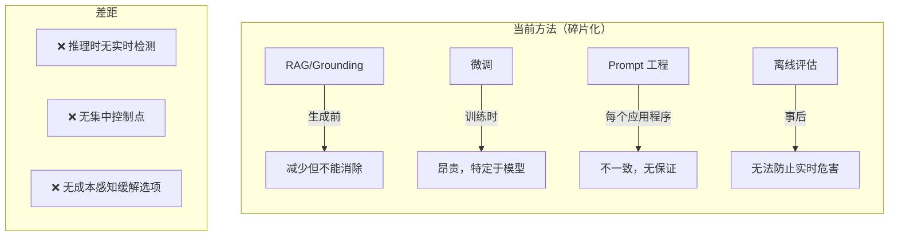

### 1.3 为什么 vLLM Semantic Router 是理想的解决方案点

vLLM Semantic Router 在 AI 基础设施栈中占据独特位置，使其非常适合幻觉缓解：

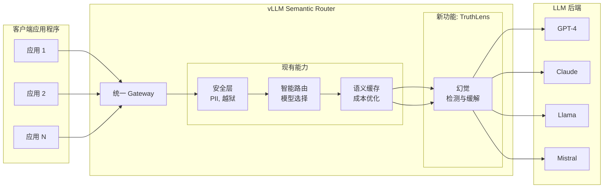

**Gateway 级幻觉控制的关键优势:**

| 优势 | 描述 |
|-----------|-------------|
| **模型无关** | 适用于任何 LLM 后端，无需修改 |
| **集中策略** | 所有应用程序的单一配置点 |
| **成本控制** | 全组织范围内对准确率与成本权衡的可见性 |
| **增量采用** | 启用每个决策、每个领域的策略 |
| **可观测性** | 幻觉事件的统一指标、日志记录和警报 |
| **纵深防御** | 补充（而非替代）RAG 和 Prompt 工程 |

### 1.4 正式问题定义

我们将 RAG 系统中的幻觉检测形式化为 **Token 级序列标注**问题。

**定义 1 (RAG 上下文).** 令 RAG 交互定义为一个元组 *(C, Q, R)*，其中：

- *C = \{c₁, c₂, ..., cₘ\}* 是检索到的上下文（文档/段落集）
- *Q* 是用户查询
- *R = (r₁, r₂, ..., rₙ)* 是作为 *n* 个 Token 序列生成的响应

**定义 2 (有根据的 vs. 幻觉 Token).** 响应 *R* 中的 Token *rᵢ* 是：

- **有根据的 (Grounded)** 如果 *C* 中存在支持包含 *rᵢ* 的主张的证据
- **幻觉的 (Hallucinated)** 如果 *rᵢ* 导致的主张：
  - (a) 与 *C* 中的信息相矛盾（矛盾幻觉），或
  - (b) 无法从 *C* 中验证且不是常识（无根据幻觉）

**定义 3 (幻觉检测函数).** 检测任务是学习一个函数：

*f: (C, Q, R) → Y*

其中 *Y = (y₁, y₂, ..., yₙ)* 且 *yᵢ ∈ \{0, 1\}* 指示 Token *rᵢ* 是否为幻觉。

**定义 4 (幻觉分数).** 给定预测 *Y* 和置信度分数 *P = (p₁, ..., pₙ)* 其中 *pᵢ = P(yᵢ = 1)*，我们定义：

- **Token 级分数**: *s_token(rᵢ) = pᵢ*
- **Span 级分数**: 对于连续 Span *S = (rᵢ, ..., rⱼ)*, *s_span(S) = max(pᵢ, ..., pⱼ)*
- **响应级分数**: *s_response(R) = 1 - ∏(1 - pᵢ)* 对于所有 *i* 其中 *pᵢ > τ_token*

**定义 5 (缓解决策).** 给定阈值 *τ*，系统采取行动：

```text
Action(R) =
  PASS        如果 s_response(R) < τ
  MITIGATE    如果 s_response(R) ≥ τ
```

---

## 2. 相关工作：幻觉缓解的最新技术

### 2.1 幻觉类型分类

在回顾检测方法之前，我们建立幻觉类型的分类法：

**类型 1: 内在幻觉 (Intrinsic Hallucination)** — 生成的内容与提供的上下文相矛盾。

*示例*: 上下文说“会议在周二”。响应说“会议安排在周三”。

**类型 2: 外在幻觉 (Extrinsic Hallucination)** — 生成的内容无法从上下文中验证且不是常识。

*示例*: 上下文讨论了公司的 Q3 收益。响应包含了任何地方都未提及的 Q4 预测。

**类型 3: 捏造 (Fabrication)** — 完全虚构的实体、引用或事实。

*示例*: “根据 Smith 等人 (2023)...”，而实际上不存在这样的论文。

| 类型 | 检测难度 | 缓解方法 |
|------|---------------------|---------------------|
| 内在 | 较容易（直接矛盾） | 上下文重新 Grounding |
| 外在 | 中等（需要知识边界） | 不确定性表达 |
| 捏造 | 较难（需要外部验证） | 交叉引用检查 |

### 2.2 检测方法

| 类别 | 代表性工作 | 机制 | 准确率 | 延迟 | 成本 |
|----------|---------------------|-----------|----------|---------|------|
| **基于 Encoder** | LettuceDetect (2025), Luna (2025) | 使用 ModernBERT/DeBERTa 进行 Token 分类 | F1: 75-79% | 15-35ms | 低 |
| **自我一致性** | SelfCheckGPT (2023) | 多重采样 + 一致性检查 | 变化 | Nx 基础 | 高 |
| **跨模型** | Finch-Zk (2025) | 多模型响应比较 | F1: +6-39% | 2-3x 基础 | 高 |
| **内部状态** | MIND (ACL 2024) | 隐藏层激活分析 | 高 | \<10ms | 需要仪器化 |

#### 2.2.1 基于 Encoder 的检测（深入探讨）

**LettuceDetect** (Kovács 等人, 2025) 将幻觉检测框架化为 **Token 级序列标注**：

- **架构**: ModernBERT-large (3.95亿参数) 带分类头
- **输入**: 拼接的 [Context, Query, Response] 带特殊 Token
- **输出**: 每个 Token 的幻觉概率
- **训练**: 在 RAGTruth 数据集（1.8万示例）上微调
- **关键创新**: 长上下文处理（8K Token）支持完整 RAG 上下文包含

**RAGTruth 基准测试表现**:

| 模型 | Token F1 | 示例 F1 | 延迟 |
|-------|----------|------------|---------|
| LettuceDetect-large | 79.22% | 74.8% | ~30ms |
| LettuceDetect-base | 76.5% | 71.2% | ~15ms |
| Luna (DeBERTa) | 73.1% | 68.9% | ~25ms |
| GPT-4 (zero-shot) | 61.2% | 58.4% | ~2s |

**为什么选择基于 Encoder 用于 TruthLens**: 高准确率、低延迟和固定成本的结合使得基于 Encoder 的检测成为 Gateway 级部署的理想选择。

#### 2.2.2 自我一致性方法

**SelfCheckGPT** (Manakul 等人, 2023) 利用了幻觉在样本间不一致的观察结果：

- **机制**: 生成 N 个响应，测量一致性
- **直觉**: 事实内容是可复现的；幻觉各不相同
- **局限性**: 需要 N 次 LLM 调用（通常 N=5-10）

**理论基础**: 如果 *P(fact)* 高，事实会出现在大多数样本中。如果每个样本的 *P(hallucination)* 低，它很少重复。

#### 2.2.3 跨模型验证

**Finch-Zk** (2025) 利用模型多样性：

- **机制**: 比较来自不同模型家族的响应
- **关键洞察**: 不同模型的幻觉方式不同
- **分段级修正**: 用更高置信度的版本替换不一致的片段

### 2.3 缓解策略

| 策略 | 代表性工作 | 机制 | 有效性 | 开销 |
|----------|---------------------|-----------|---------------|----------|
| **自我完善** | Self-Refine (NeurIPS 2023) | 迭代反馈循环 | 减少 40-60% | 2-4x 延迟 |
| **Chain-of-Verification** | CoVe (ACL 2024) | 生成验证问题 | 减少 50-70% | 3-5x 延迟 |
| **Multi-Agent Debate** | MAD (2024) | 多个 Agent 辩论并收敛 | 减少 60-80% | 5-10x 延迟 |
| **跨模型修正** | Finch-Zk (2025) | 目标分段替换 | 准确率提升高达 9% | 3x 延迟 |

#### 2.3.1 自我完善（深入探讨）

**Self-Refine** (Madaan 等人, NeurIPS 2023) 证明了 LLM 可以改进自己的输出：

```text
循环:
  1. 生成初始响应 R₀
  2. 生成关于 R₀ 的反馈 F（同一模型）
  3. 使用 F 生成完善后的响应 R₁
  4. 重复直到收敛或达到最大迭代次数
```

**关键发现**:

- 当反馈**具体**时效果最好（不仅仅是“改进这个”）
- 2-3 次迭代后收益递减
- 需要模型具备自我修正的知识

**幻觉的局限性**: 如果模型缺乏正确的知识，自我完善可能没有帮助，甚至可能引入新的错误。

#### 2.3.2 Chain-of-Verification (CoVe)

**CoVe** (Dhuliawala 等人, ACL 2024) 生成验证问题：

```text
1. 生成响应 R
2. 从 R 中提取事实主张
3. 对每个主张，生成验证问题
4. 使用上下文回答验证问题
5. 根据验证结果修改 R
```

**优势**: 显式验证步骤捕捉细微错误。
**劣势**: 由于多步过程导致高延迟 (3-5x)。

#### 2.3.3 Multi-Agent Debate

**Multi-Agent Debate** (Du 等人, 2024) 使用多个 LLM 实例：

```text
1. 多个 Agent 生成响应
2. Agent 相互批评对方的响应
3. Agent 根据批评进行修改
4. 重复 N 轮
5. 综合最终响应
```

**理论优势**: 多样化的视角捕捉盲点。
**实际挑战**: 高成本 (5-10x) 和延迟。

### 2.3 准确率-延迟-成本三角

研究一致显示了一个基本的权衡：

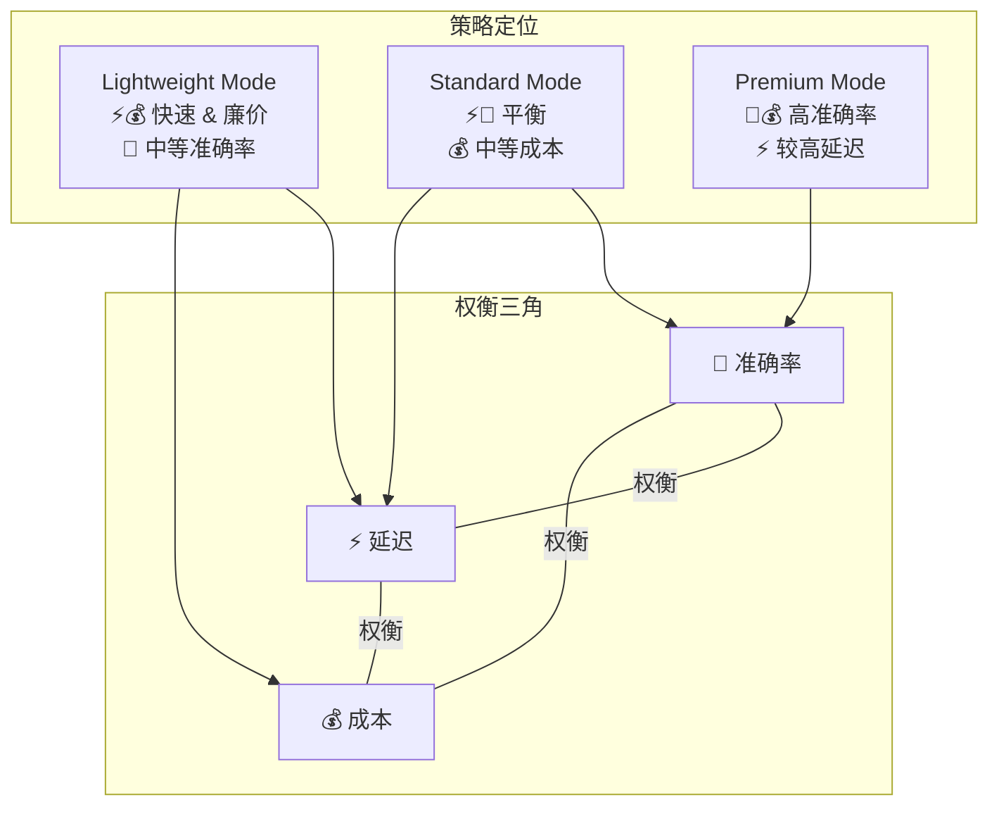

**关键洞察**: 没有单一方法能优化所有三个维度。TruthLens 通过提供**用户可选择的操作模式**来解决这个问题，让组织在这个权衡三角上选择自己的位置。

---

## 3. 理论基础

本节建立了 TruthLens 三种模式架构的理论基础，借鉴了序列标注、迭代优化、集成学习和多 Agent 系统理论。

### 3.1 幻觉检测作为序列标注

#### 3.1.1 Token 分类架构

现代幻觉检测利用微调用于 Token 分类的基于 Transformer 的 Encoder。给定输入序列 *X = [CLS] C [SEP] Q [SEP] R [SEP]*，Encoder 产生上下文化的表示：

*H = Encoder(X) ∈ ℝ^(L×d)*

其中 *L* 是序列长度，*d* 是隐藏维度。对于响应中的每个 Token *rᵢ*，我们计算：

*P(yᵢ = 1|X) = σ(W · hᵢ + b)*

其中 *W ∈ ℝ^d*, *b ∈ ℝ* 是学习到的参数，*σ* 是 Sigmoid 函数。

#### 3.1.2 为什么选择 ModernBERT 进行检测

Encoder 架构的选择显著影响检测质量。我们采用 ModernBERT (Warner 等人, 2024)，因为它具有以下理论优势：

| 属性 | ModernBERT | 传统 BERT | 对检测的影响 |
|----------|------------|------------------|---------------------|
| **上下文长度** | 8,192 Token | 512 Token | 处理完整的 RAG 上下文而不截断 |
| **Attention** | 旋转位置嵌入 (RoPE) | 绝对位置 | 更好的长距离依赖建模 |
| **架构** | GeGLU 激活，无偏置 | GELU，带偏置 | 改进细粒度分类的梯度流 |
| **效率** | Flash Attention, Unpadding | 标准 Attention | 2x 推理加速实现实时检测 |

#### 3.1.3 评分函数设计

从 Token 级到响应级分数的聚合需要精心设计。我们提出一个 **Noisy-OR** 聚合模型：

*s_response(R) = 1 - ∏ᵢ(1 - pᵢ · 𝟙[pᵢ > τ_token])*

**理论论证**: Noisy-OR 模型假设不同 Token 处的幻觉事件是独立的。虽然这是一种近似，但它提供了：

1. **单调性**: 增加一个幻觉 Token 永远不会降低响应分数
2. **敏感性**: 单个高置信度幻觉会触发检测
3. **校准**: 分数近似 *P(∃ 响应 R 中的幻觉)*

**替代方案：基于 Span 的聚合**

对于相关联的幻觉（常见于捏造实体），我们首先将连续的幻觉 Token 分组为 Span，然后聚合：

*s_response(R) = max\{s_span(S₁), s_span(S₂), ..., s_span(Sₖ)\}*

这降低了对分词伪影的敏感性，并专注于语义单元。

#### 3.1.4 阈值选择理论

检测阈值 *τ* 控制精确率-召回率的权衡。根据决策理论：

**命题 1 (最优阈值).** *给定成本比 λ = C_FN / C_FP（假阴性成本与假阳性成本之比），最优阈值满足：*

*τ* = 1 / (1 + λ · (1-π)/π)*

*其中 π 是幻觉的先验概率。*

**实际意义**:

| 领域 | λ (成本比) | 推荐 τ | 理由 |
|--------|----------------|---------------|-----------|
| 医疗 | 10-100 | 0.3-0.5 | 漏掉幻觉是灾难性的 |
| 金融 | 5-20 | 0.4-0.6 | 错误信息带来的监管风险 |
| 客户支持 | 1-2 | 0.6-0.7 | 平衡用户体验和准确性 |
| 创意 | 0.1-0.5 | 0.8-0.9 | 过度标记损害创造力 |

### 3.2 自我完善理论

#### 3.2.1 迭代完善作为不动点迭代

Standard Mode 采用迭代自我完善，这可以形式化为寻找完善算子的不动点。

**定义 6 (完善算子).** 令 *T: R → R* 为完善算子，其中：

*T(Rₜ) = LLM(Prompt_refine(C, Q, Rₜ, Detect(Rₜ)))*

迭代过程为：*R₀ → R₁ → R₂ → ... → R**

**定理 1 (收敛条件).** *完善序列 \{Rₜ\} 收敛于不动点 R\* 如果：*

1. *幻觉分数序列 \{s(Rₜ)\} 单调非递增*
2. *分数有下界 (s(R) ≥ 0)*
3. *LLM 表现出一致性：相似的 Prompt 产生相似的输出*

**证明草图**: 条件 1 和 2 确保分数序列根据单调收敛定理收敛。条件 3（LLM 一致性）确保响应序列本身收敛，而不仅仅是分数。

#### 3.2.2 收敛速度分析

**实证观察**: 自我完善通常表现出 **次线性收敛**：

*s(Rₜ) - s(R*) ≤ O(1/t)*

这是因为：

1. **简单的幻觉**（显式矛盾）在早期迭代中被修正
2. **困难的幻觉**（微妙的无根据主张）可能会持续存在或震荡
3. **收益递减** 在实践中 2-3 次迭代后出现

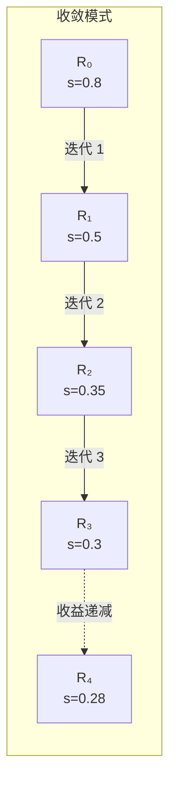

#### 3.2.3 修正的 Prompt 工程原则

有效的完善 Prompt 必须满足几个理论属性：

**原则 1 (特异性)**: Prompt 必须识别*哪些* Span 是幻觉，而不仅仅是存在幻觉。

**原则 2 (Grounding)**: Prompt 必须提供原始上下文 *C* 以启用事实核查。

**原则 3 (保留)**: Prompt 必须指示模型保留准确的内容。

**原则 4 (不确定性)**: 当无法修正时，模型应表达不确定性而不是捏造替代方案。

**完善 Prompt 模板结构**:

```text
给定:
- 上下文: [检索到的段落 C]
- 查询: [用户问题 Q]
- 响应: [当前响应 Rₜ，标记了幻觉 Span]

以下 Span 可能是幻觉: [List of (span, confidence)]

指令:
1. 对每个标记的 Span，对照上下文进行验证
2. 如果矛盾：使用上下文证据进行修正
3. 如果无法验证且不是常识：移除或用不确定性限定
4. 保留所有准确、有根据的内容
5. 保持连贯的叙事流
```

### 3.3 多模型协作理论

Premium Mode 利用多个 LLM 进行交叉验证。我们将此建立在集成学习和多 Agent 辩论理论的基础上。

#### 3.3.1 集成学习视角

**定理 2 (多样性-准确性权衡).** *对于 M 个模型的集成，每个模型的错误率为 ε 且成对相关性为 ρ，多数投票下的集成错误率为：*

*ε_ensemble ≈ ε · (1 + (M-1)ρ) / M*    *当 ε < 0.5 时*

**推论**: 仅当 ρ < 1（模型多样化）时，集成错误率随 M → ∞ 趋近于零。

**对 TruthLens 的启示**:

| 模型组合 | 预期多样性 (1-ρ) | 错误减少 |
|-------------------|--------------------------|-----------------|
| 相同模型家族 (GPT-4 变体) | 低 (0.2-0.4) | 10-20% |
| 不同家族 (GPT-4 + Claude) | 中 (0.4-0.6) | 30-50% |
| 不同架构 (Transformer + 其他) | 高 (0.6-0.8) | 50-70% |

#### 3.3.2 Multi-Agent Debate 框架

除了简单的投票，**辩论**使模型能够**争论**事实主张并就真理达成一致。

**定义 7 (论证框架).** 论证框架是一对 *AF = (A, →)* 其中：

- *A* is a set of arguments (factual claims from each model)
- *→ ⊆ A × A* is an attack relation (contradictions between claims)

**定义 8 (Grounded Extension).** AF 的 Grounded Extension *E* 是最大的无冲突论点集，它能抵御所有攻击。

**Multi-Agent Debate 协议**:

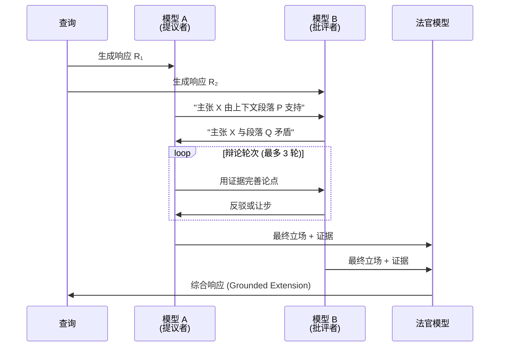

#### 3.3.3 共识机制

**机制 1: 多数投票**

*y_final(token) = argmax_y |\{m : f_m(token) = y\}|*

- 简单，快速
- 需要奇数个模型
- 不考虑模型置信度

**机制 2: 加权置信度聚合**

*p_final(token) = Σₘ wₘ · pₘ(token) / Σₘ wₘ*

其中 *wₘ* 是模型 m 的校准可靠性权重。

- 考虑不同的模型专长
- 需要校准的置信度分数

**机制 3: 分段级替换 (Finch-Zk)**

对于响应 *R₁* 中的每个主张分段 *S*：

1. 将 R₁ 分段为主张 \{S₁, S₂, ..., Sₖ\}
2. 对于每个 Sᵢ，检查与 R₂ 的一致性
3. 如果不一致：用更可靠模型的版本替换 Sᵢ
4. 输出：具有最高置信度分段的混合响应

#### 3.3.5 成本-准确性权衡分析

| 配置 | 模型 | 预期准确率提升 | 成本倍数 |
|---------------|--------|----------------------|-----------------|
| 双模型投票 | 2 | +15-25% | 2x |
| 三模型投票 | 3 | +25-35% | 3x |
| 双模型 + 法官 | 2+1 | +30-40% | 3x |
| 全辩论 (3 轮) | 2+1 | +40-50% | 5-6x |

#### 3.3.6 理想用例

- **医疗诊断辅助**: 生命攸关的决策
- **法律文档分析**: 责任影响
- **金融咨询**: 需要监管合规
- **安全关键系统**: 航空航天、核能等

### 3.4 三种模式架构的理论论证

#### 3.4.1 帕累托前沿分析

准确率-延迟-成本空间存在一个帕累托前沿：提高一个维度需要牺牲另一个维度。

**命题 2 (三个操作点).** *A-L-C 空间中的帕累托前沿有三个自然的“拐点”，对应于：*

1. **成本主导机制** (Lightweight): 最小干预，仅检测
2. **平衡机制** (Standard): 中度完善，单模型
3. **准确率主导机制** (Premium): 最大验证，多模型

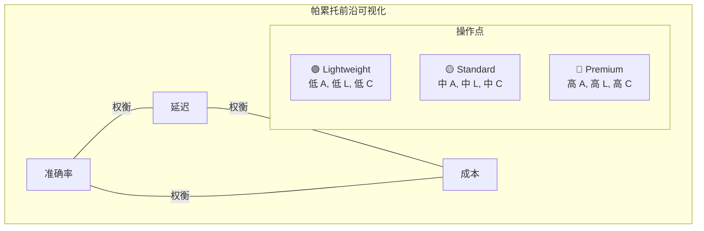

#### 3.4.2 为什么不是连续控制？

有人可能会问：为什么是离散模式而不是连续参数？

**论点 1 (认知负荷)**: 用户无法有效地推理连续的权衡。三种离散模式映射到直观的概念：“快速/便宜”、“平衡”、“最佳质量”。

**论点 2 (操作复杂性)**: 每种模式涉及性质不同的机制（仅检测 vs. 迭代 vs. 多模型）。中间点需要复杂的插值。

**论点 3 (实证差距)**: 帕累托前沿不是平滑的——存在自然的间隙，中间配置相对于最近的离散模式提供的收益很少。

#### 3.4.3 模式选择作为在线学习

在生产中，模式选择可以公式化为 **Multi-armed Bandit** 问题：

- **Arm**: \{Lightweight, Standard, Premium\}
- **奖励**: 用户满意度（代理：无负面反馈）
- **成本**: 延迟 + API 成本

**Thompson Sampling** 方法：维护每种模式成功概率的 Beta 分布，采样并选择，根据结果更新。这实现了每种查询类型的自适应模式选择。

---

## 4. 系统架构

### 4.1 高级架构

TruthLens 集成到 vLLM Semantic Router 的 ExtProc 管道中，创建一个全面的请求-响应安全边界：

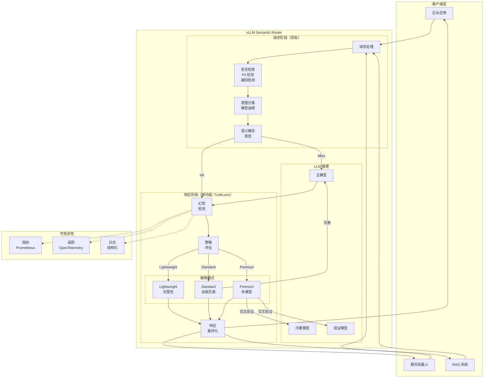

### 4.2 检测流程

幻觉检测过程对完整的上下文-查询-响应三元组进行操作：

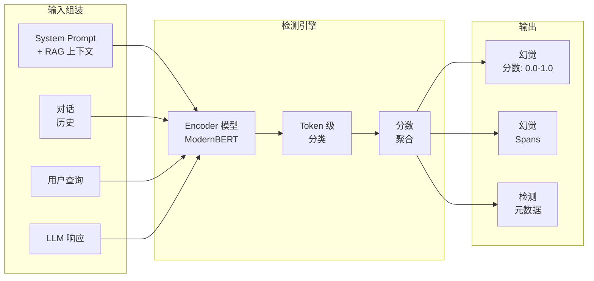

---

## 5. 用户策略选项：成本-准确率谱系

TruthLens 提供三种操作模式，允许组织根据其特定需求在成本-准确率权衡谱系上定位自己。

### 5.1 策略概览

```mermaid
flowchart TB
    subgraph "用户选择"
        USER[组织<br/>需求]
    end

    subgraph "模式选择"
        direction LR
        L[🟢 Lightweight Mode<br/>成本优先]
        S[🟡 Standard Mode<br/>平衡]
        P[🔴 Premium Mode<br/>准确率优先]
    end

    subgraph "Lightweight Mode"
        L1[单次检测通过]
        L2[仅警告注入]
        L3[无额外 LLM 调用]
    end

    subgraph "Standard Mode"
        S1[检测 + 自我完善]
        S2[同一模型迭代]
        S3[最多 3-5 次迭代]
    end

    subgraph "Premium Mode"
        P1[多模型检测]
        P2[交叉验证]
        P3[协作修正]
    end

    USER --> L
    USER --> S
    USER --> P

    L --> L1 --> L2 --> L3
    S --> S1 --> S2 --> S3
    P --> P1 --> P2 --> P3
```

### 5.2 模式比较矩阵

| 维度 | 🟢 Lightweight | 🟡 Standard | 🔴 Premium |
|-----------|---------------|-------------|------------|
| **主要目标** | 成本效率 | 平衡 | 最大准确率 |
| **检测方法** | 单次 Encoder 通过 | Encoder + 自查 | 多模型交叉验证 |
| **缓解行动** | 警告注入 | 迭代自我完善 | 多模型协作修正 |
| **延迟开销** | +15-35ms | +200-500ms (2-4x) | +1-3s (5-10x) |
| **成本倍数** | 1.0x (仅检测) | 1.5-2.5x | 3-5x |
| **幻觉减少** | 仅意识 | 40-60% | 70-85% |
| **最适合** | 内部工具，聊天机器人 | 商业应用 | 医疗，法律，金融 |

### 5.3 Lightweight Mode: 成本优化的检测

**理念**: 在提供幻觉意识的同时最小化运营成本。此模式将幻觉检测视为一种**信息服务**，而不是干预系统。

#### 5.3.1 理论基础

Lightweight Mode 建立在 **有限理性理论 (Bounded Rationality Theory)** (Simon, 1955) 之上：当优化成本超过收益时，满足（接受“足够好”）是理性的。

**成本效益分析**:

令 *C_detect* = 检测成本，*C_mitigate* = 缓解成本，*p* = 幻觉概率，*L* = 未检测到的幻觉带来的预期损失。

Lightweight Mode 是最优的，当：*C_detect < p · L* 但 *C_detect + C_mitigate > p · L*

换句话说：检测值得付出成本，但完全缓解不值得。

#### 5.3.2 机制

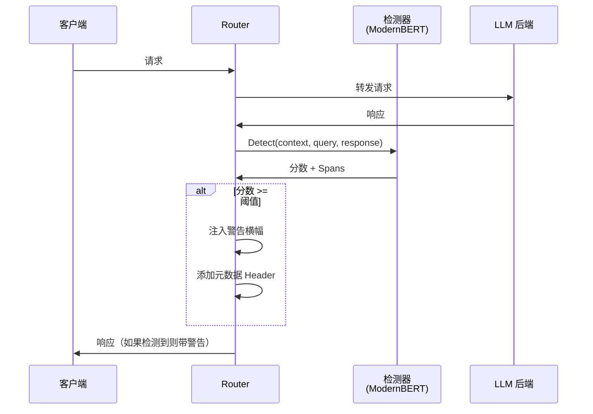

**特点**:

- 初始生成后**无额外 LLM 调用**
- **固定检测成本**，无论响应长度如何
- **面向用户的警告** 赋予人工验证能力
- **丰富的元数据** 用于下游分析

#### 5.3.3 理论保证

**命题 3 (检测延迟界限).** *对于序列长度 L ≤ 8192 的 ModernBERT-large:*

*T_detect ≤ O(L²/chunk_size) + O(L · d)*

*实际上: 对于 L ≤ 4096，现代 GPU 上 T_detect ≤ 35ms。*

**命题 4 (直通模式无假阴性).** *在 Lightweight Mode 中，所有超过阈值 τ 的幻觉都会被标记。该模式从不抑制检测结果。*

#### 5.3.4 理想用例

- 内部知识库（用户可以验证）
- 开发者助手（技术用户）
- 创意写作工具（幻觉可能是期望的）
- 低风险客户互动（有人工升级可用）

---

### 5.4 Standard Mode: 平衡的自我完善

**理念**: 利用同一模型通过迭代完善来自我修正检测到的幻觉。此模式实现了一个**闭环反馈系统**，其中 LLM 既充当生成器又充当修正器。

#### 5.4.1 理论基础

Standard Mode 建立在 **自我一致性理论 (Self-Consistency Theory)** 和 **迭代完善 (Iterative Refinement)** 之上：

**定理 3 (自我完善有效性).** *如果 LLM 已经学习了查询类的正确答案分布，那么使用显式错误反馈进行 Prompt 会增加正确输出的概率：*

*P(correct | feedback on error) > P(correct | no feedback)*

*前提是反馈是准确且可操作的。*

**直觉**: LLM 通常“知道”正确答案，但由于以下原因未能在第一次尝试时产生它：

- 采样噪声 (Temperature > 0)
- 注意力集中在错误的上下文区域
- 权重中的竞争模式

显式错误反馈重定向注意力并抑制不正确的模式。

#### 5.4.2 收敛分析

**定义 9 (完善序列).** 序列 *\{Rₜ\}* 对于 *t = 0, 1, 2, ...* 其中：

*R₀ = LLM(Q, C)*  (初始响应)
*Rₜ₊₁ = LLM(Prompt_refine(Q, C, Rₜ, Detect(Rₜ)))*  (完善后的响应)

**引理 1 (单调分数下降).** *在温和假设（一致的 LLM，准确的检测）下，幻觉分数序列是非递增的：*

*s(Rₜ₊₁) ≤ s(Rₜ)* 以高概率

**实证收敛模式**:

| 迭代 | 典型分数减少 | 边际改进 |
|-----------|------------------------|----------------------|
| 1 → 2 | 30-50% | 高 |
| 2 → 3 | 15-25% | 中 |
| 3 → 4 | 5-15% | 低 |
| 4+ | \<5% | 递减 |

这促使默认 *max_iterations = 3* 的设置。

#### 5.4.3 机制

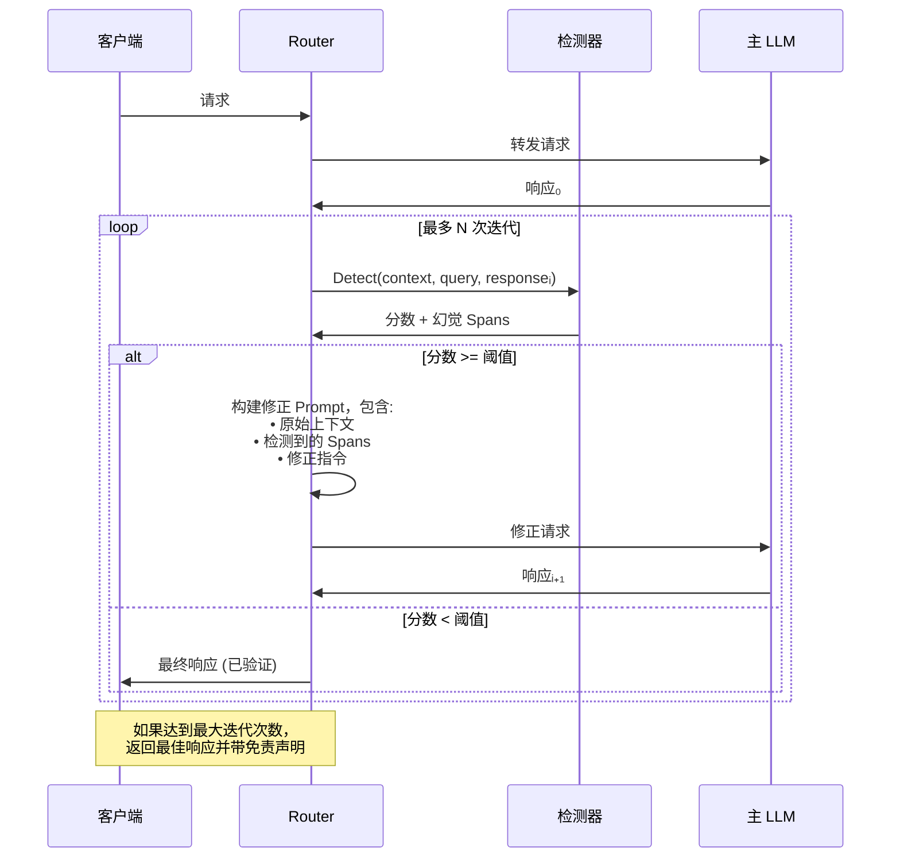

**特点**:

- 通过自我反思进行**迭代改进**
- **同一模型**保持一致性
- **有界迭代**控制成本
- 如果收敛失败，**优雅降级**

**研究基础**: 基于 Self-Refine (NeurIPS 2023) 和 Chain-of-Verification (ACL 2024) 原则。

**理想用例**:

- 商业智能报告
- 客户支持（升级查询）
- 教育内容
- 技术文档

### 5.5 Premium Mode: 多模型协作验证

**理念**: 通过多样化的模型视角和协作错误修正实现最大准确率。此模式实现了**集成验证**和**对抗性辩论**机制。

#### 5.5.1 理论基础：集成学习

Premium Mode 建立在 **Condorcet 陪审团定理 (Condorcet's Jury Theorem)** (1785) 和现代**集成学习**理论之上：

**定理 4 (Condorcet 陪审团定理，改编).** *对于 M 个在二元决策上准确率 p > 0.5 的独立模型，多数投票准确率随 M → ∞ 趋近于 1：*

*P(majority correct) = Σ(k=⌈M/2⌉ to M) C(M,k) · pᵏ · (1-p)^(M-k) → 1*

**推论 (多样性要求)**: 该定理需要**独立性**。相关的模型（相同的训练数据、架构）提供的收益递减。

**实际多样性来源**:

| 多样性类型 | 示例 | 独立性水平 |
|----------------|---------|-------------------|
| 训练数据 | GPT vs Claude | 高 |
| 架构 | Transformer vs Mamba | 非常高 |
| 微调 | Base vs Instruct | 中 |
| Prompting | 不同的 System Prompt | 低 |

#### 5.5.2 理论基础：Multi-Agent Debate

除了投票，**辩论**使模型能够完善彼此的推理：

**定义 10 (辩论协议).** 模型 M₁, M₂ 与法官 J 之间的辩论包括：

1. **生成阶段**: 两个模型生成响应 R₁, R₂
2. **批评阶段**: 每个模型批评对方的响应
3. **辩护阶段**: 模型用证据为自己的主张辩护
4. **综合阶段**: 法官 J 根据论点产生最终响应

**定理 5 (辩论改进 Grounding).** *当模型必须用上下文 C 中的证据证明主张时，辩论过程会过滤无根据的主张：*

*如果 M₂ 无法在 C 中找到支持证据，R₁ 中的无根据主张将受到 M₂ 的挑战。*

**信息论观点**: 辩论充当论证空间的**有损压缩**，仅保留经受住交叉审查的主张。

#### 5.5.3 机制

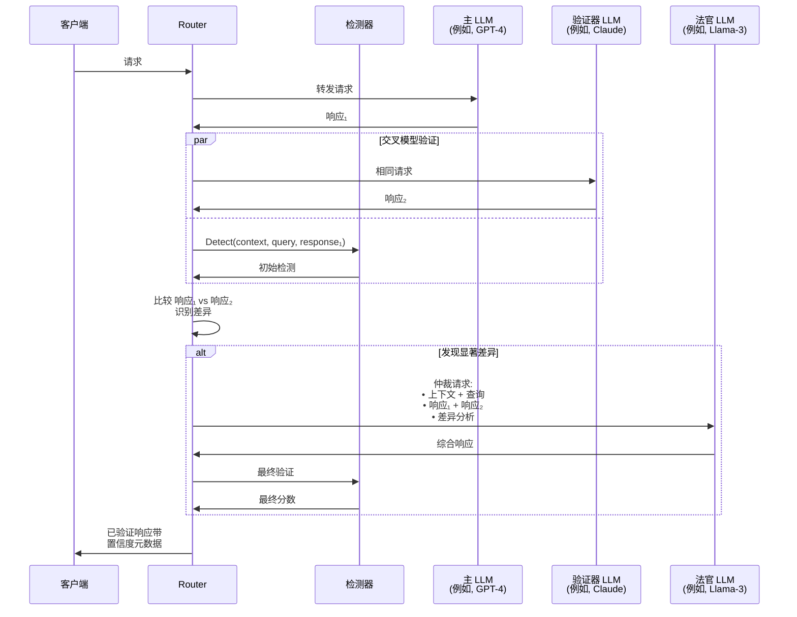

#### 5.5.4 共识机制

**机制 1: 分段级投票**

对于每个主张分段 *S*:

*vote(S) = Σₘ 𝟙[S ∈ Rₘ] / M*

如果 *vote(S) > 0.5*（多数一致），则接受 *S*。

**机制 2: 加权置信度融合**

*R_final = argmax_R Σₘ wₘ · sim(R, Rₘ)*

其中 *wₘ* 是模型 m 的校准置信度，*sim* 是语义相似度。

**机制 3: 细粒度替换 (Finch-Zk)**

1. 将 R₁ 分段为主张 \{S₁, S₂, ..., Sₖ\}
2. 对于每个 Sᵢ，检查与 R₂ 的一致性
3. 如果不一致：用更可靠模型的版本替换 Sᵢ
4. 输出：具有最高置信度分段的混合响应

#### 5.5.5 成本-准确率权衡分析

| 配置 | 模型 | 预期准确率提升 | 成本倍数 |
|---------------|--------|----------------------|-----------------|
| 双模型投票 | 2 | +15-25% | 2x |
| 三模型投票 | 3 | +25-35% | 3x |
| 双模型 + 法官 | 2+1 | +30-40% | 3x |
| 全辩论 (3 轮) | 2+1 | +40-50% | 5-6x |

#### 5.5.6 理想用例

- **医疗诊断辅助**: 生命攸关的决策
- **法律文档分析**: 责任影响
- **金融咨询**: 需要监管合规
- **安全关键系统**: 航空航天、核能等

### 5.6 模式选择决策树

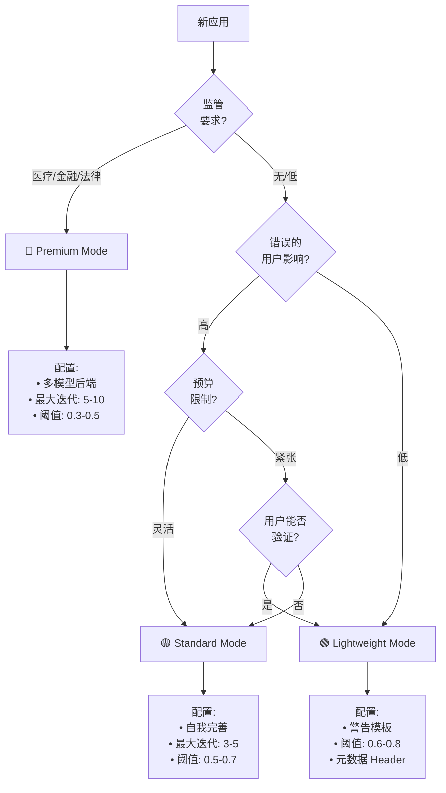

---

## 6. 配置设计

### 6.1 全局配置

```yaml
# 全局幻觉检测设置
hallucination:
  enabled: true

  # 检测模型 (基于 ModernBERT)
  model_id: "models/lettucedetect-large-modernbert-en-v1"
  use_cpu: false

  # 默认操作模式
  default_mode: "standard"  # lightweight | standard | premium

  # 检测阈值 (0.0 - 1.0)
  # 越低 = 越严格, 越高 = 越宽松
  threshold: 0.6

  # Lightweight Mode 的警告模板
  warning_template: |
    ⚠️ **注意**: 此响应可能包含无法根据提供的上下文完全验证的信息。
    在采取行动之前，请验证关键事实。

  # Standard Mode 设置
  standard:
    max_iterations: 3
    convergence_threshold: 0.4  # 如果分数低于此值则停止

  # Premium Mode 设置
  premium:
    verification_models:
      - "claude-3-sonnet"
      - "gpt-4-turbo"
    judge_model: "llama-3.1-70b"
    max_iterations: 5
    require_consensus: true
```

### 6.2 每次决策的插件配置

```yaml
decisions:
  # 医疗领域 - 需要最大准确率
  - name: "medical_assistant"
    description: "医疗信息查询"
    priority: 100
    rules:
      operator: "OR"
      conditions:
        - type: "domain"
          name: "healthcare"
        - type: "keyword"
          name: "medical_terms"
    modelRefs:
      - model: "gpt-4-turbo"
    plugins:
      - type: "hallucination"
        configuration:
          enabled: true
          mode: "premium"
          threshold: 0.3           # 非常严格
          max_iterations: 5
          require_disclaimer: true

  # 金融服务 - 高准确率
  - name: "financial_advisor"
    description: "金融分析和建议"
    priority: 90
    rules:
      operator: "OR"
      conditions:
        - type: "domain"
          name: "finance"
    plugins:
      - type: "hallucination"
        configuration:
          enabled: true
          mode: "standard"
          threshold: 0.5
          max_iterations: 4

  # 一般客户支持 - 平衡
  - name: "customer_support"
    description: "一般客户咨询"
    priority: 50
    rules:
      operator: "OR"
      conditions:
        - type: "domain"
          name: "support"
    plugins:
      - type: "hallucination"
        configuration:
          enabled: true
          mode: "standard"
          threshold: 0.6
          max_iterations: 2

  # 内部工具 - 成本优化
  - name: "internal_assistant"
    description: "内部知识库查询"
    priority: 30
    rules:
      operator: "OR"
      conditions:
        - type: "domain"
          name: "internal"
    plugins:
      - type: "hallucination"
        configuration:
          enabled: true
          mode: "lightweight"
          threshold: 0.7

  # 创意写作 - 禁用检测
  - name: "creative_writing"
    description: "创意内容生成"
    priority: 20
    rules:
      operator: "OR"
      conditions:
        - type: "domain"
          name: "creative"
    plugins:
      - type: "hallucination"
        configuration:
          enabled: false  # 这里“幻觉”是一个特性
```

### 6.3 响应 Header

当启用幻觉检测时，以下 Header 将添加到所有响应中：

| Header | 描述 | 示例值 |
|--------|-------------|----------------|
| `X-TruthLens-Enabled` | 是否执行了检测 | `true`, `false` |
| `X-TruthLens-Mode` | 使用的操作模式 | `lightweight`, `standard`, `premium` |
| `X-TruthLens-Score` | 幻觉置信度分数 | `0.0` - `1.0` |
| `X-TruthLens-Detected` | 幻觉是否超过阈值 | `true`, `false` |
| `X-TruthLens-Iterations` | 完善迭代次数 | `0`, `1`, `2`, ... |
| `X-TruthLens-Latency-Ms` | 检测/缓解延迟 | `35`, `450`, `2100` |

### 6.4 指标和可观测性

**Prometheus 指标:**

| 指标 | 类型 | 标签 | 描述 |
|--------|------|--------|-------------|
| `truthlens_detections_total` | Counter | `decision`, `mode`, `detected` | 总检测操作 |
| `truthlens_score` | Histogram | `decision`, `mode` | 分数分布 |
| `truthlens_latency_seconds` | Histogram | `mode`, `operation` | 处理延迟 |
| `truthlens_iterations` | Histogram | `decision`, `mode` | 完善迭代计数 |
| `truthlens_models_used` | Counter | `model`, `role` | Premium Mode 中的模型使用情况 |

---

## 7. 参考文献

1. Kovács, Á., & Recski, G. (2025). *LettuceDetect: A Hallucination Detection Framework for RAG Applications*. arXiv:2502.17125

2. Goel, A., Schwartz, D., & Qi, Y. (2025). *Finch-Zk: Zero-knowledge LLM hallucination detection and mitigation through fine-grained cross-model consistency*. arXiv:2508.14314

3. Lin, Z., Niu, Z., Wang, Z., & Xu, Y. (2024). *Interpreting and Mitigating Hallucination in MLLMs through Multi-agent Debate*. arXiv:2407.20505

4. Tran, K.T., et al. (2025). *Multi-Agent Collaboration Mechanisms: A Survey of LLMs*. arXiv:2501.06322

5. Manakul, P., Liusie, A., & Gales, M.J. (2023). *SelfCheckGPT: Zero-Resource Black-Box Hallucination Detection for Generative Large Language Models*. arXiv:2303.08896

6. Tang, L., et al. (2024). *MiniCheck: Efficient Fact-Checking of LLMs on Grounding Documents*. EMNLP 2024

7. Madaan, A., et al. (2023). *Self-Refine: Iterative Refinement with Self-Feedback*. NeurIPS 2023

8. Dhuliawala, S., et al. (2024). *Chain-of-Verification Reduces Hallucination in Large Language Models*. ACL Findings 2024

9. Su, W., et al. (2024). *Unsupervised Real-Time Hallucination Detection based on LLM Internal States (MIND)*. ACL Findings 2024

10. Belyi, M., et al. (2025). *Luna: A Lightweight Evaluation Model to Catch Language Model Hallucinations*. COLING 2025

---

## 附录 A: 完整系统流程图

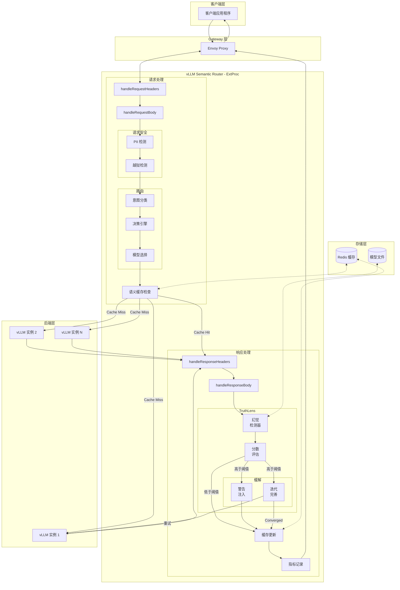

---

## 附录 B: 术语表

| 术语 | 定义 |
|------|------------|
| **Hallucination** | LLM 生成的内容事实不正确或不受上下文支持 |
| **Intrinsic Hallucination** | 来自模型内部参数知识的捏造事实 |
| **Extrinsic Hallucination** | 没有在提供的上下文中 Grounding 的内容（常见于 RAG） |
| **ExtProc** | Envoy External Processor - 启用 Gateway 处的请求/响应修改 |
| **Token-Level Detection** | 识别特定的幻觉 Token/Span |
| **Self-Refinement** | 同一模型修正自身幻觉的迭代过程 |
| **Cross-Model Verification** | 使用多个不同模型验证事实一致性 |
| **Multi-Agent Debate** | 多个 LLM Agent 争论立场以收敛于事实真理 |
| **RAG** | 检索增强生成 (Retrieval-Augmented Generation) - 用检索到的文档 Grounding LLM |
| **ModernBERT** | 支持 8K 上下文的最先进 Encoder 架构 |
| **Accuracy-Latency-Cost Triangle** | 幻觉缓解策略中的基本权衡 |
| **Convergence Threshold** | 幻觉被认为已解决的分数 |

---

**文档版本:** 1.0 | **最后更新:** 2025年12月
