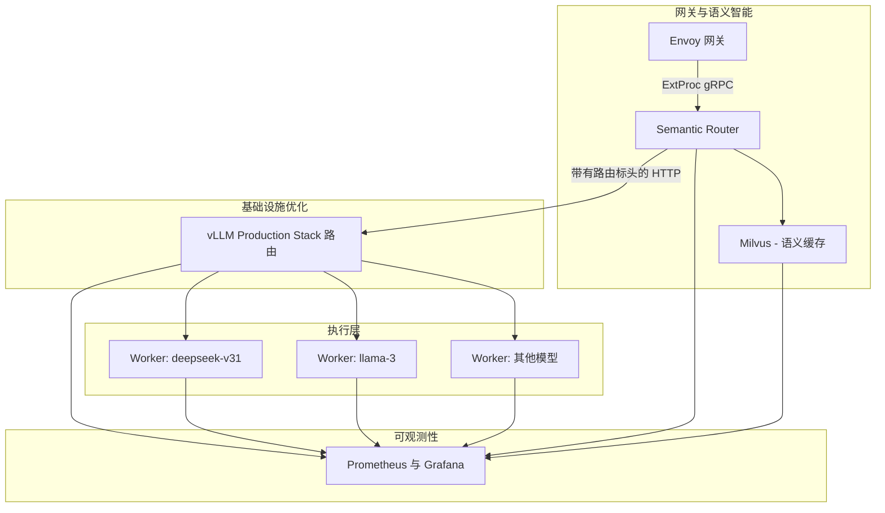
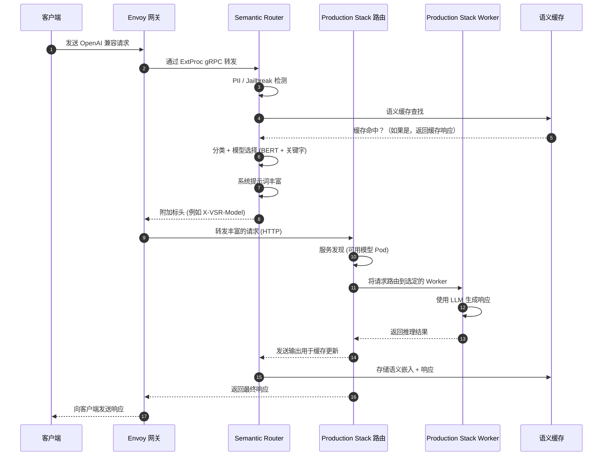

# vLLM Production Stack 的语义智能层

## 1. 概述

本文旨在概述 **vLLM Semantic Router** 与 **vLLM Production Stack** 之间的全面集成策略。vLLM Production Stack 是一个用于大规模部署 vLLM 的云原生参考系统，提供了多种部署方式来启动 vLLM 服务器、请求路由和可观测性堆栈。请求路由可以将流量导向不同的模型，通过 Kubernetes API 执行服务发现和容错，并支持轮询 (Round-robin)、基于会话、前缀感知 (Prefix-aware)、KV 感知 (KV-aware) 以及具有 LMCache 原生支持的分离式预填充路由。Semantic Router 增加了一个 **系统智能层**，用于对每个用户请求进行分类，从模型池中选择最合适的模型，注入特定领域的系统提示词 (System Prompt)，执行语义缓存，并强制执行企业级安全检查（如 PII 和 Jailbreak 检测）。

通过结合这两个系统，我们构建了一个统一的推理堆栈。Semantic Router 确保每个请求都由最合适的模型回答；Production Stack 路由最大限度地提高了基础设施和推理效率，并公开了丰富的指标。它们共同提供：

* **系统级智能** — 理解用户意图，选择正确的模型，注入适当的系统提示词并预过滤工具。
* **基础设施效率** — 从单个实例扩展到分布式 vLLM 部署而无需更改应用程序代码，通过 Token 级优化和 LMCache 原生支持在多个模型之间路由流量。
* **安全与合规** — 在 PII 和 Jailbreak 提示词到达模型之前将其拦截。
* **可观测性** — 通过 Production Stack 的 Grafana 仪表板监控请求、延迟和 GPU 使用情况，并追踪 Semantic Router 的决策。

---

## 2. 动机：为什么在 Production Stack 中使用 Semantic Router？

### 2.1 Production Stack 能力（当前状态）

vLLM Production Stack 为大规模服务大语言模型提供了构建模块：

| 能力 | 描述 |
| --- | --- |
| **分布式部署** | 部署具有 LMCache 原生支持的多个 vLLM 实例，在不更改应用程序代码的情况下从单实例扩展到多实例集群。 |
| **请求路由** | 将请求路由到不同的模型和实例，支持包括分离式预填充、KV Cache 感知、前缀感知、会话和基于轮询的多种路由逻辑。 |
| **服务发现与容错** | 使用 Kubernetes API 进行自动发现，并从池中移除故障节点。 |
| **可观测性** | 提供 Grafana 仪表板以显示延迟分布、首字延迟 (TTFT)、运行中或挂起的请求数量以及 GPU KV Cache 使用情况。 |
| **部署简易性** | 使用 Helm Charts/CRD/推理网关安装堆栈并公开 OpenAI 兼容的 API。 |

---

这些功能优化了基础设施的使用，但在路由 Token 和请求的级别上运行，而不是基于请求的含义。路由无法感知任务的复杂性或领域，除了简单的用户指定模型 ID 之外，不会决定由哪个模型处理给定的提示词。

### 2.2 Semantic Router 能力（语义智能层）

Semantic Router 在 vLLM 之上增加了系统级智能：

| 能力 | 描述 |
| --- | --- |
| **模型混合路由** | 对每个传入的 OpenAI API 请求进行分类，并根据任务复杂性和领域选择最合适的模型。通过将任务路由到专门的模型而不是单一的通用模型，提高了准确性。 |
| **自动工具选择** | 识别哪些外部工具与提示词相关，减少不必要的工具调用。 |
| **特定类别的系统提示词** | 根据查询分类注入专门的系统提示词（数学、编码、业务等），以提高推理能力和 Token 效率。 |
| **安全过滤器** | 检测 PII 并拦截包含敏感数据的提示词；识别 Jailbreak 提示词并防止其被发送到 LLM。 |
| **相似性缓存** | 使用嵌入 (Embedding) 来缓存提示词的语义表示；如果新提示词与之前的提示词相似，则可以立即返回缓存的响应。 |
| **分布式追踪** | 发出涵盖分类、安全检查、缓存和路由决策的 OpenTelemetry 追踪。 |

---

这些能力实现了**任务感知推理**，可以根据每个请求调整推理深度和模型选择。然而，Semantic Router 不管理 GPU 资源或 KV Cache，在与可扩展的服务堆栈耦合时运行效果最佳。

### 2.3 差异化分析：优势互补

这两个系统针对推理堆栈的不同层级：

#### Semantic Router – 请求智能层

* 通过多信号分类（结合关键字匹配、嵌入相似性和基于 LLM 的分类）理解用户意图。
* 根据特定领域的评分选择性能最佳的模型和可选工具。
* 通过注入系统提示词和添加路由元数据标头来丰富请求。
* 执行安全过滤（PII 和 Jailbreak 检测）和语义缓存。

#### Production Stack – 基础设施优化层

* 通过 LMCache 原生支持，使用轮询、基于会话、前缀感知路由、KV Cache 感知和分离式预填充路由来提高推理效率。
* 将 KV Cache 卸载到 CPU 内存和远程存储（通过 LMCache），并支持 KV Cache 感知路由策略。
* 通过 Kubernetes 进行水平扩展，并公开用于监控的指标和追踪。

这些层级之间的重叠极小。Semantic Router 根据用户在问**什么**做出决策，而 Production Stack 优化请求**如何**执行。因此，集成将语义智能与 GPU 级效率结合在一起。

### 2.4 为什么集成很重要：实现系统级智能

如果没有语义智能，Production Stack 会平等地处理所有请求：简单的提示词与复杂的任务使用相同的大模型和推理深度，导致不必要的成本和延迟。如果没有基础设施级的优化，Semantic Router 无法扩展到高 QPS 工作负载或高效管理 KV Cache。通过集成它们：

* 简单的查询（例如事实性问题）可以路由到更小、更便宜的模型，并使用最少的推理，而复杂的任务则使用更大的模型和思维链 (Chain-of-Thought) 推理。
* Semantic Router 的模型选择会过滤 Worker 池，仅保留服务于所选模型的 Worker；然后 Production Stack 的路由选择具有最高 KV Cache 重叠或负载最低的 Worker。
* 双层缓存（语义缓存 + KV Cache）允许系统要么从缓存中立即提供响应，要么重用 Token 级前缀以减少预填充成本。
* 端到端追踪提供了对语义和基础设施决策的可见性，从而实现持续优化。

---

## 3. 目标与非目标

### 3.1 目标

集成的首要目标是：

1. **无缝集成** – Semantic Router 作为 Production Stack 路由之前的预处理层运行。请求从网关流向 Semantic Router，然后流向 Production Stack 路由，最后流向适当的 vLLM Worker。
2. **双层缓存** – 将语义缓存（请求级）与 KV Cache 重用（Token 级）结合，使得精确或相似的提示词可以避免完整推理，且部分重叠可以最大限度地减少预填充成本。
3. **模型感知路由** – Production Stack 路由根据 Semantic Router 选择的模型过滤 Worker。根据不同的路由逻辑选择最佳 Worker，以最大限度地提高缓存命中率。
4. **安全强制执行** – 在提示词到达模型之前拦截包含 PII 或 Jailbreak 模式的提示词。
5. **统一可观测性** – 使用 OpenTelemetry 在单个 Span 中追踪语义决策和基础设施路由，并通过 Grafana 监控系统指标。
6. **零停机更新** – Semantic Router 的路由规则和模型评分可以热加载，而无需重启 Production Stack。生产路由器的动态配置允许实时更新服务发现和路由逻辑。

### 3.2 非目标

1. **替换 Production Stack 路由** – Semantic Router 增强了现有路由；它不接管基础设施路由。如果 Semantic Router 发生故障，Production Stack 路由将继续使用默认模型路由运行。
2. **修改 vLLM 或 Production Stack 核心** – 集成使用标准 API（Envoy 的 ExtProc gRPC 或 HTTP 标头注入），不需要更改 vLLM 内部。
3. **统一配置** – 将语义策略的配置与基础设施设置分开，以允许独立演进。
4. **同步耦合** – 如果其中一个系统不可用，两个系统都可以独立运行；回退路径可确保优雅降级。

---

## 4. 提案细节

### 4.1 设计原则

1. **关注点分离** – 保持语义智能与基础设施优化解耦。Semantic Router 专注于理解和丰富请求，而 Production Stack 路由负责 Worker 选择和调度。
2. **API 驱动集成** – 使用 Envoy 的外部处理 (ExtProc) gRPC API 或 HTTP 标头注入将 Semantic Router 与 Production Stack 网关和路由集成。这避免了修改任何一个系统的内部。
3. **故障安全设计** – 如果 Semantic Router 不可用或返回错误，网关会将原始请求转发给 Production Stack 路由（绕过语义处理）。Production Stack 路由默认使用用户指定的模型或轮询逻辑。
4. **Kubernetes 原生** – 利用 Helm Charts/CRD 进行可重复部署。

### 4.2 系统架构

集成系统由四个层级组成：

#### 系统架构图

1. **网关与语义智能**
    * **Envoy 网关** — 接收 OpenAI 兼容的 API 请求，并通过 ExtProc gRPC 将其转发给 Semantic Router。作为统一的入口点。
    * **Semantic Router 服务** — 一个无状态的 gRPC 服务，运行多个副本以实现高可用性。它执行分类、安全过滤、语义缓存查找、模型和工具选择以及请求丰富。
    * **Milvus 服务** — 用于语义缓存的向量数据库；存储具有可配置 TTL 的嵌入和响应。
    * **ConfigMap 和模型 PVCs** — 保存路由规则、类别定义和下载的模型权重。

2. **基础设施优化 (Production Stack)**
    * **vLLM-router 服务** — 现有的 Production Stack，负责服务发现、负载均衡和 KV Cache 感知/分离式预填充路由。它解析由 Semantic Router 注入的 `model` 字段，并将 Worker 过滤为提供该模型的 Worker。
    * **LMCache / KV-Cache 管理器** — 可选地将 KV Cache 卸载到远程存储，并公开缓存命中的指标。
    * **Prometheus 和 Grafana** — 收集并可视化请求延迟、TTFT 和 GPU KV Cache 使用情况等指标。

3. **执行 (vLLM Worker)**
    * **模型池** — 每个模型独立的 StatefulSet（例如 llama-3 chat, deepseek-v31, qwen3）和无头服务 (Headless Service)。每个 Worker 运行具有前缀感知或 KV 感知缓存的 vLLM 并生成响应。
    * **动态扩展** — Horizontal Pod Autoscaler 或 KEDA 根据 QPS 和 GPU 利用率扩展 Worker 副本。

4. **存储层**
    * **语义缓存存储** — Milvus 使用持久卷 (Persistent Volume) 存储嵌入和响应。
    * **KV Cache 存储** — 用于热缓存的 GPU 内存；用于温/冷缓存的系统内存或 NVMe。LMCache 可以通过多级存储层次结构在实例之间卸载和共享 KV Cache。

### 4.3 请求流程

#### 4.3.1 端到端请求处理

1. **客户端请求** — 客户端向网关发送一个 OpenAI 兼容的请求（例如 `/v1/chat/completions`），并指定 `model:"auto"`。
2. **Envoy 拦截请求** — Envoy 接收 HTTP 请求，并通过 ExtProc gRPC 调用 Semantic Router，传递请求体和标头。
3. **Semantic Router 处理** — Semantic Router 执行以下流水线：
    * **安全过滤** — 运行 PII 和 Jailbreak 检测；如果概率超过阈值，则拦截或脱敏提示词。
    * **语义缓存查找** — 生成 MiniLM 嵌入并在 Milvus 中搜索相似查询。命中时，立即返回缓存的响应。
    * **多信号分类** — 应用关键字匹配（快速路径）、嵌入相似性（概念搜索）和 ModernBERT 分类。选择置信度最高的信号并分配类别。
    * **模型和工具选择** — 查找该类别的模型评分并选择最佳模型。根据查询选择相关的工具和推理模式（开启/关闭）。
    * **请求丰富** — 注入系统提示词，将 `model` 字段更新为所选模型，添加路由标头（例如 `X-VSR-Category`、`X-VSR-Model`、`X-VSR-Reasoning`）并转发给 Envoy。
4. **Envoy 转发丰富的请求** — Envoy 将丰富的请求转发给 Production Stack 路由 (vllm-router 服务)。路由无法感知语义修改，并将其视为对指定模型的正常请求。
5. **Production Stack 路由** — vLLM-router 执行服务发现，并将 Worker 池过滤为提供所选模型的 Worker。它使用轮询、基于会话或前缀/KV 感知算法来选择具有最高缓存重叠或最低负载的 Worker。
6. **vLLM Worker 执行** — 选定的 vLLM Worker 接收包含注入系统提示词的请求并执行推理。前缀缓存和 KV Cache 重用减少了预填充时间。
7. **语义缓存更新** — 当 Worker 返回响应时，Semantic Router 将查询嵌入和响应存储在 Milvus 中，并设置可配置的 TTL。
8. **客户端响应** — Envoy 将响应返回给客户端，可选地添加可观测性标头（所选模型、类别、推理模式、缓存命中/未命中）。

#### 4.3.2 双层缓存策略

集成利用了两个互补的缓存层：

* **第 1 层：语义缓存（请求级）** — 在 Milvus 中存储完整的请求/响应对。当新查询与缓存查询之间的余弦相似度超过阈值（例如 0.85）时，直接返回缓存的响应而无需任何推理。这消除了不必要的 Token 生成。
* **第 2 层：KV Cache（Token 级）** — 由 Production Stack 路由和 LMCache 管理。前缀感知或 KV 感知路由确保具有重叠前缀的请求被路由到 KV Cache 所在的同一 Worker。即使语义缓存未命中，重用 KV Cache 也能减少预填充时间并提高吞吐量。

结合起来，这些缓存提供了三种场景：

| 场景 | 语义缓存 | KV Cache | 结果 |
| --- | --- | --- | --- |
| **精确语义匹配** | 命中 | 不适用 | 立即返回缓存响应（无推理） |
| **部分匹配 / 重叠** | 未命中 | 命中 | 执行推理但重用 KV Cache；降低延迟 |
| **新查询** | 未命中 | 未命中 | 完整推理；正常进行分类和 Worker 路由 |

### 4.4 在 Kubernetes 中集成

#### 4.4.1 部署架构

集成遵循 Kubernetes 中的分层服务架构（概念布局见下图）：

1. **Envoy 网关与 Semantic Router**
    * `gateway-svc` — 在端口 8080 上公开 `/v1/*` API。配置有 ExtProc 过滤器，可将请求流式传输到 `semantic-router-svc`。
    * `semantic-router-svc` — 一个在端口 50051 上公开 gRPC 的 ClusterIP 服务。它部署多个 Pod 以实现高可用性，并通过 PersistentVolumeClaims 挂载模型权重。它依赖于用于语义缓存的 `milvus-svc` 和用于路由规则的 ConfigMap。
    * `milvus-svc` — 在端口 19530 上运行 Milvus 向量数据库，并存储嵌入和响应。

2. **Production Stack 路由与可观测性**
    * `vllm-router-svc` — 公开 Production Stack 路由的 HTTP 端点（默认端口 80）。它接收来自 Envoy 的丰富请求，并执行服务发现和 Worker 选择。
    * `prometheus-svc` 与 `grafana-svc` — 收集并可视化延迟、TTFT 和 KV Cache 使用情况的指标。

3. **vLLM Worker 池**
    * `vllm-{model}-svc` — 每个模型（例如 `llama3-chat`、`deepseek-v31`）的无头服务，公开 Worker Pod。Worker 运行 vLLM。
    * Horizontal Pod Autoscaler 根据 CPU/GPU 使用情况和 QPS 扩展 Worker 副本。

4. **存储**
    * 用于 Milvus、模型权重和 LMCache（如果启用）的持久卷。

#### 4.4.2 服务通信流

以下序列说明了聊天补全 (Chat Completions) 请求的端到端流程：

1. **客户端请求** – 客户端发送带有 `model: "auto"` 的 `POST /v1/chat/completions`。
2. **网关** – 网关 (`gateway-svc`) 接收请求，并通过 ExtProc gRPC 将其转发给 `semantic-router-svc`（包括请求体和标头）。
3. **Semantic Router** – 执行融合路由：关键字匹配、相似性搜索和 ModernBERT 分类，选择一个类别（例如 *math*），选择最佳模型（例如 `deepseek-v31`），注入数学系统提示词并设置 `X-VSR-Model: deepseek-v31`、`X-VSR-Category: math` 标头。它还运行 PII/Jailbreak 检测和语义缓存查找；在缓存命中时，它返回缓存的响应。
4. **网关** – 接收丰富的请求。如果返回了缓存的响应，它将跳过后续步骤并直接回复客户端。否则，它将请求转发给端口 80 上的 `vllm-router-svc`。
5. **Production Stack 路由** – 解析 `model` 字段 (`deepseek-v31`)，相应地过滤 Worker 池，并使用不同的路由选择具有最高缓存重叠的 Worker。它将请求转发给所选 Worker 的 Pod。
6. **vLLM Worker** – 使用注入的系统提示词处理请求，并在可用时重用 KV Cache 块。Worker 流式传输或返回生成的响应。
7. **语义缓存更新** – 收到响应后，Semantic Router 将查询嵌入和响应存储在 Milvus 中，并设置 TTL 以供将来的缓存命中。
8. **向客户端返回响应** – 网关将响应返回给客户端，可选地包括可观测性标头（`X-VSR-Model-Used`、`X-VSR-Cache-Hit` 等）。

### 4.5 实施计划（改编自 [Dynamo Proposal](https://vllm-semantic-router.com/docs/proposals/nvidia-dynamo-integration)）

集成将分四个阶段交付：

#### 阶段 1：基础

**目标：**

* 建立 Semantic Router 与 Production Stack 之间的基本集成
* 在请求体中实现透明的模型覆盖
* 验证端到端请求流程

**任务：**

1. **Semantic Router 增强**：
    * 实现请求体修改：model: "auto" → "selected-model"
    * 在消息数组中注入系统提示词
    * 添加可选的可观测性标头：
        * x-vsr-selected-category: 分类结果
        * x-vsr-selected-reasoning: 推理模式（"on" 或 "off"）
        * x-vsr-selected-model: 所选模型名称
        * x-vsr-injected-system-prompt: 系统提示词注入状态（"true" 或 "false"）
        * x-vsr-cache-hit: 缓存命中状态（仅在缓存命中时）
        * 确保维持 OpenAI API 兼容性

2. **Production Stack**：
    * PS 接收标准的 OpenAI API 请求
    * 模型字段已包含所选模型的名称
    * 无需感知 VSR 的参与
    * 现有的路由逻辑保持不变

3. **测试**：
    * 模型覆盖逻辑的单元测试
    * 系统提示词注入的集成测试
    * 验证 PS 路由到正确的模型池
    * 1K RPS 的压力测试

**成功标准**：

* ✅ 请求根据覆盖的模型名称路由到正确的模型池
* ✅ 系统提示词正确注入到消息中
* ✅ PS 在不进行修改的情况下透明运行
* ✅ 延迟开销 < 10ms
* ✅ 对现有部署无破坏性更改

#### 阶段 2：可观测性与监控

**目标：**

* 跨 VSR → PS → Worker 的全栈分布式追踪
* 全面的指标和仪表板
* 告警和 SLO 监控

**任务：**

1. **分布式追踪 (OpenTelemetry):**

    * 从 VSR 通过 PS 到 Worker 的追踪上下文传播
    * Span 层级：
        * 根 Span: Envoy 网关
        * 子 Span: Semantic Router（融合路由、缓存、安全）
            * 次级子 Span: BERT 分类
            * 次级子 Span: 关键字匹配
            * 次级子 Span: 相似性搜索
            * 次级子 Span: 信号融合与决策
        * 子 Span: PS 前端（路由、Worker 选择）
        * 子 Span: vLLM Worker（推理执行）
    * 标头中自动注入追踪 ID
    * 支持 Jaeger、Tempo 和其他 OTLP 兼容的后端

2. **指标收集：**
    * Semantic Router 指标：
        * 融合路由性能：
            * BERT 分类延迟和准确率
            * 关键字匹配命中率和延迟
            * 相似性搜索延迟
            * 信号融合决策分布
        * 语义缓存命中率 (Milvus)
        * PII/Jailbreak 检测率
        * 按类别的模型选择分布
    * PS 指标：
        * Worker 利用率
        * TTFT、TPOT、ITL
        * KV Cache 命中率
    * 按组件划分的端到端延迟分解

3. **仪表板：**
    * 用于集成堆栈的 Grafana 仪表板
    * 带有追踪瀑布图的请求流可视化
    * 成本和性能分析
    * 缓存效率指标（语义 + KV）

**成功标准：**

* ✅ 单个分布式追踪跨越所有层级 (VSR → PS → Worker)
* ✅ 最小的追踪采样开销
* ✅ 实时仪表板运行正常
* ✅ 追踪上下文在服务边界间正确传播

#### 阶段 4：生产硬化

**目标：**

* 故障处理与弹性
* 性能优化
* 生产部署

**任务：**

1. **弹性：**
    * Semantic Router 故障回退到 PS
    * 缓存后端的断路器
    * 优雅降级策略

2. **性能：**
    * 延迟优化（目标：合并延迟 < 50ms）
    * 吞吐量测试（目标：10K RPS）
    * 资源利用率调优

3. **文档：**
    * 部署指南
    * 配置参考
    * 故障排查手册

**成功标准：**

* ✅ 高可用性
* ✅ 低 P99 延迟（路由开销）
* ✅ 持续吞吐量 10K+ RPS

---

## 5. 安全与隐私考虑

### 5.1 PII 检测与拦截

PII 检测模型使用 ModernBERT 来识别敏感 Token，如姓名、电子邮件或社会安全号码。超过可配置阈值（默认 0.7）的包含 PII 的提示词在发送到模型之前会被拦截或脱敏。操作员可以选择拒绝请求或屏蔽检测到的 Token。Semantic Router 返回响应标头，指示 PII 已被拦截以供审计。

### 5.2 Jailbreak 预防 (Prompt Guard)

Jailbreak 检测可以防御提示词注入攻击、指令覆盖和其他对抗模式。在 BERT、RoBERTa 或 ModernBERT 上运行的 LoRA 适配分类器层级结构可以检测此类提示词。超过配置阈值（默认为 0.7）的请求将被拦截，网关将返回错误消息。响应标头包括检测到的攻击类型和置信度。该机制保护 vLLM 模型免受恶意指令的影响，并确保安全提示词到达推理引擎。

### 5.3 数据驻留与合规

存储在 Milvus 中的嵌入和缓存响应可能构成个人数据。部署应在静止状态下对持久卷进行加密，并执行适当的数据保留策略。Milvus 支持按集合设置生存时间 (TTL)；管理员应调整 TTL 值以平衡缓存有效性和数据最小化（例如，默认 2 小时）。确保存储的地理位置符合组织和监管要求。

---

## 6. 运营考虑

### 6.1 监控与告警

操作员应同时监控语义和基础设施指标：

* **语义指标** – 分类延迟、PII/Jailbreak 检测率、语义缓存命中率、嵌入队列长度。这些可以作为 Prometheus 指标从 Semantic Router 导出，并在 Grafana 中可视化。
* **基础设施指标** – vLLM 路由吞吐量、Worker CPU/GPU 利用率、KV Cache 命中率、请求延迟分布和 TTFT。
* **告警** – 为高分类延迟、高拦截提示词率、低语义缓存命中率、不断上升的 GPU 内存使用量和高 Worker 队列长度设置告警。

### 6.2 维护与更新

* **模型更新** – 定期重新训练分类、PII 和 Jailbreak 检测模型，并通过替换 Semantic Router Pod 中挂载的模型文件来推出更新。使用蓝绿部署 (Blue-Green Deployment) 或金丝雀部署 (Canary Deployment) 以最大限度地减少中断。
* **路由规则** – 维护一个指定类别→模型映射和工具策略的 ConfigMap。Semantic Router 监视此 ConfigMap 的更改，并在不重启的情况下重新加载规则。
* **扩展** – 根据观察到的负载模式调整 Horizontal Pod Autoscaler 和 LMCache 参数。考虑在 vLLM 中启用睡眠/唤醒模式以在低流量期间降低成本。

### 6.3 故障模式与恢复

潜在的故障场景包括：

1. **Semantic Router 不可用** – 请求绕过 Semantic Router 直接转发给 Production Stack 路由。响应的准确性可能较低或成本较高，但服务仍保持运行。
2. **Milvus 停机** – 语义缓存查找和更新失败；分类和安全检查仍能正常工作。缓存命中率暂时下降。
3. **vLLM Worker 故障** – Production Stack 路由的健康检查会移除故障 Worker。自动扩缩容会产生新的 Worker 以维持容量。
4. **KV Cache 耗尽** – 当 GPU 内存满时，KV Cache 块可能会被驱逐，从而降低前缀重用的收益。LMCache 可以将其卸载到系统内存或 NVMe，并在 Worker 之间共享缓存；监控 GPU KV 使用情况并扩展内存或减少并发请求。

---

## 7. 未来增强

### 7.1 高级路由策略

将语义信号集成到基础设施路由中是未来研究的一个令人兴奋的领域。例如，分类置信度可能会影响 Worker 的选择：高熵查询可能更倾向于具有更多空闲内存或更快 GPU 的 Worker。对一致性哈希 (Consistent Hashing) 和局部敏感哈希 (LSH) 的研究可能会进一步提高 KV Cache 命中率。

### 7.2 跨层优化

集成语义层和基础设施层为联合优化提供了机会：

* **语义感知的 KV Cache 管理** – 使用类别信息来调度 KV Cache 的驱逐和共享。相似领域（例如数学查询）可以在 Worker 之间共享 KV Cache 块以提高重用率。
* **可插拔的嵌入和分类模型** – 通过 vLLM Worker 提供嵌入和分类模型，以统一模型托管。当 CPU 资源成为瓶颈时，这将允许 GPU 加速，并简化模型管理。
* **动态推理预算** – 受到任务感知推理研究的启发，根据用户重要性、成本约束或服务水平目标调整推理深度和思维链激活。

### 7.3 多租户支持

企业通常需要按租户隔离路由策略和模型池。未来的工作包括将租户 ID 添加到语义缓存键和路由标头中，为每个租户配置专用的 Milvus 集合，并支持按租户的模型目录。基于角色的访问控制 (RBAC) 将确保租户无法访问彼此的缓存或模型。

---

## 8. 参考资料

1. [vLLM Production Stack](https://github.com/vllm-project/production-stack)
2. [vLLM Semantic Router](https://github.com/vllm-project/semantic-router)
3. [NVIDIA Dynamo 的语义智能层](https://vllm-semantic-router.com/docs/proposals/nvidia-dynamo-integration#46-implementation-plan)
